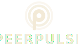
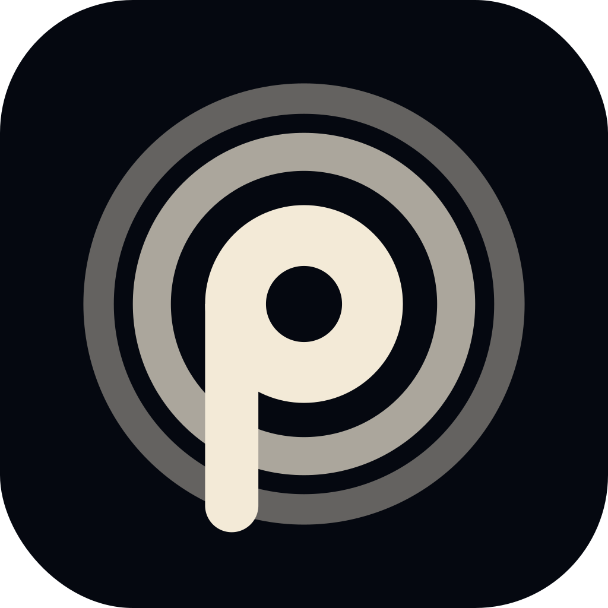

# PeerPulse brand guidelines

Pseudonymous civic infrastructure for parallel vote tabulation. The brand should read as restrained, trustworthy, and adult — not corporate, not partisan, not startup.

---

## 1. The mark

<p align="center">
  
</p>

A capital **P** rendered as a beacon: a thick bowl-ring with a hole at its center, a long vertical stem dropping from the bowl's left tangent, and two faint pulse-rings emanating outward. Monochrome.

**Concept stack:**
- **P** — the brand letterform.
- **Beacon** — the bowl is the lantern, the stem is the tower. Civic warning, civic guidance, civic visibility.
- **Pulse** — the rings are signal propagating outward. The mesh.

### Anatomy (viewBox 64 × 64)

| Element       | Geometry                                | Stroke / fill                    |
|---------------|-----------------------------------------|----------------------------------|
| Outer halo    | `cx=32 cy=32 r=27`                      | stroke 4,  opacity 0.4           |
| Middle halo   | `cx=32 cy=32 r=20`                      | stroke 5,  opacity 0.7           |
| Bowl-ring     | `cx=32 cy=32 r=9` stroke-width 8        | outer r=13, inner r=5 (hole r=5) |
| Stem          | `x=19→26, y=32→62`                      | filled, flat top, rounded bottom |

The stem's top sits exactly at the bowl's left tangent point (x=19, y=32), so the bowl's vertical tangent and the stem's left edge share the same line — no protrusion, no kink.

### Variants

#### Mark only

<p align="center">
  
</p>

`logo/peerpulse-mark.svg`

#### Wordmark only

<p align="center">
  
</p>

`logo/peerpulse-wordmark.svg`

#### Horizontal lockup

<p align="center">
  
</p>

`logo/peerpulse-lockup.svg` — default for nav bars, headers, press materials.

#### Stacked lockup

<p align="center">
  
</p>

`logo/peerpulse-lockup-stacked.svg` — for splash screens, social profile avatars, posters.

### Clear-space

Around any lockup or standalone mark, reserve at least **one bowl-diameter** (26 viewBox units, or `0.4 × mark height`) of empty space on every side. Don't crop into it with type, photos, frames, or other graphics.

### Minimum sizes

| Context           | Minimum |
|-------------------|---------|
| Mark, dark bg     | 24 px   |
| Mark, light bg    | 28 px   |
| Horizontal lockup | 120 px wide |
| Stacked lockup    | 96 px wide |

### Color adaptation

Every brand SVG uses `currentColor` and ships with a `prefers-color-scheme` rule baked in: cream `#f3ead7` on dark surfaces, ink `#0c1222` on light. Inline-embedded SVGs (`<svg>` in HTML) instead inherit from the host's `color` property — so the same file works in markdown docs, dark websites, light press releases, and any custom-themed surface without per-context variants.

---

## 2. Color

Monochrome by design. Trust is built through restraint, not through palette.

| Token       | Hex       | Use                                                                |
|-------------|-----------|--------------------------------------------------------------------|
| Navy        | `#050810` | Default app and site background. Mark background on icons.         |
| Surface     | `#0a1326` | Card surfaces, splash gradients.                                   |
| Cream       | `#f3ead7` | The mark and wordmark color on dark surfaces. Default text. Trust. |
| Ink         | `#0c1222` | The mark and wordmark color on light surfaces.                     |
| Amber       | `#eab308` | **CTAs and election-day urgency only.** Never the default.         |

### What changed from the prior palette

- **The four pillar colors (Tabulate amber / Surveys blue / Journal purple / Learn green) are removed from brand use.** Features should not carry color identity in the umbrella brand. Where pillar-specific surfaces are needed, the mark and wordmark stay monochrome; the pillar can be signaled through typographic or contextual cues, not color.
- **Amber is reserved.** It still anchors the primary CTA ("Download APK") and election-day alert states, but it no longer appears in the mark, wordmark, or navigation chrome.

---

## 3. Typography

| Use         | Family        | Weight | Style notes                                           |
|-------------|---------------|--------|-------------------------------------------------------|
| Wordmark    | IBM Plex Sans | 700    | All caps, letter-spacing `0.08em`.                    |
| Headings    | IBM Plex Sans | 600–700| Sentence case. Letter-spacing `-0.02em` on display sizes. |
| Body        | IBM Plex Sans | 400    | 1.6 line-height. No letter-spacing.                   |
| Kickers / labels | IBM Plex Mono | 500–600 | All caps, letter-spacing `0.12–0.16em`. For section eyebrows, metadata. |
| Data, code  | IBM Plex Mono | 400–500| Monospace tabular figures preferred where available.  |

The wordmark SVG embeds a font-family chain that falls back to `system-ui` if Plex isn't loaded. For production assets where font availability is uncertain (PDF press releases, embedded raster images), **outline the type** in your design tool before exporting.

---

## 4. App icon

<p align="center">
  
</p>

### Master (`icon/peerpulse-icon-1024.svg`)

- 1024 × 1024 canvas
- Rounded square, radius **224** (22% of width)
- Solid navy `#050810` fill
- Mark centered at 80% of canvas (820 × 820)
- Padding 102 per side (10% of canvas)
- Mark color: cream `#f3ead7`

### Android adaptive (Android 8+)

Two layers, both 108 × 108 dp:

| Layer       | File                                | Content                                                                |
|-------------|-------------------------------------|------------------------------------------------------------------------|
| Foreground  | `icon/peerpulse-adaptive-fg.svg`    | Mark only, inset 18 dp on every side (fits inside 72 dp safe zone).    |
| Background  | `icon/peerpulse-adaptive-bg.svg`    | Solid navy `#050810`, edge-to-edge.                                    |

The launcher applies its own mask shape (circle, rounded square, squircle, teardrop). The mark must remain fully visible under every mask shape — the 72 dp safe-zone inset guarantees this.

---

## 5. Favicon

<p align="center">
  
  &nbsp;&nbsp;
  
  &nbsp;&nbsp;
  
</p>

`favicon/peerpulse-favicon.svg` is byte-identical to the canonical mark — no simplification. At 16 px the outer halos antialias into a soft glow rather than resolving as discrete rings (intended degradation); the bowl-ring and stem stay crisp.

```html
<link rel="icon" type="image/svg+xml" href="/favicon.svg" />
```

---

## 6. Don'ts

- **Don't recolor the mark per-feature.** Pillar identity does not live in color. The mark is always cream-on-dark or ink-on-light.
- **Don't apply gradients, shadows, glows, or strokes to the mark itself.** The mark is flat; the only depth comes from the existing opacity fade across the halo rings.
- **Don't rotate the mark.** The stem is vertical for a reason — it's a beacon, not an ornament.
- **Don't stretch the mark.** Aspect ratio is 1:1.
- **Don't add a stroke or outline around the mark on contrast-difficult backgrounds.** If contrast is bad, change the background, not the mark.
- **Don't put the mark on a photographic background without a solid panel behind it.** The halo opacity makes it unreadable on busy images.
- **Don't use amber as the mark color.** Amber is a CTA color, not a brand mark color.
- **Don't pair the mark with a second logo without ~2 bowl-diameters of separation** (e.g., partner endorsements, co-branding strips).

---

## 7. Voice

The brand voice is short, declarative, and unrhetorical. PeerPulse is technical infrastructure built by citizens for citizens; the language should match.

- **Do:** "Citizens count, together." · "No central server. No party. No permission required." · "Signed at the polling station. Published in real time."
- **Don't:** "Empowering democracy in the digital age." · "Revolutionising elections." · Anything that sounds like a Series A deck.

---

## 8. File inventory

```
brand/
├── showcase.html                    Live mockup gallery
├── guidelines.md                    This document
├── logo/
│   ├── peerpulse-mark.svg           Mark only
│   ├── peerpulse-wordmark.svg       Wordmark only
│   ├── peerpulse-lockup.svg         Horizontal lockup (mark + wordmark)
│   └── peerpulse-lockup-stacked.svg Vertical lockup
├── icon/
│   ├── peerpulse-icon-1024.svg      App icon master
│   ├── peerpulse-adaptive-fg.svg    Android adaptive foreground
│   └── peerpulse-adaptive-bg.svg    Android adaptive background
└── favicon/
    └── peerpulse-favicon.svg        Favicon (identical to mark)
```

---

## 9. Next-step integration

These changes are not yet reflected in the live site or app:

- `apps/web/app/globals.css` — replace the existing nav `nav-logo-mark` (gradient amber square + peer-graph SVG) with the canonical mark. Remove the pillar color variables (`--svy`, `--jrn`, `--lrn`) from active brand use; keep `--tab` (amber) only for CTAs.
- `apps/web/components/Nav.tsx` — replace inline peer-graph SVG with `peerpulse-mark.svg`.
- `apps/mobile/android/app/src/main/res/mipmap-*` — generate launcher icon bitmaps from `peerpulse-icon-1024.svg` and ship the adaptive XML referencing the fg/bg SVGs.
- `apps/web/public/favicon.svg` — copy `favicon/peerpulse-favicon.svg`.

These integrations are out of scope for this brand-kit drop; track them as follow-on tickets.
