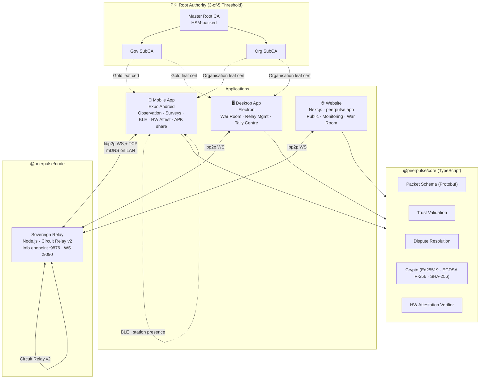
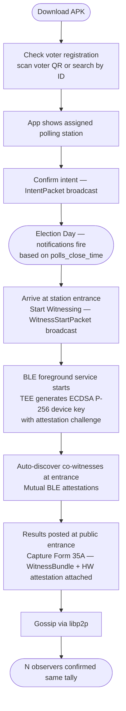
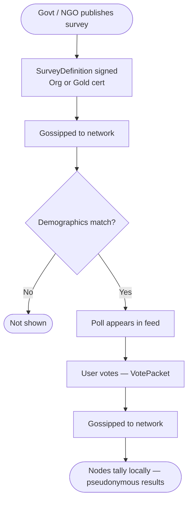
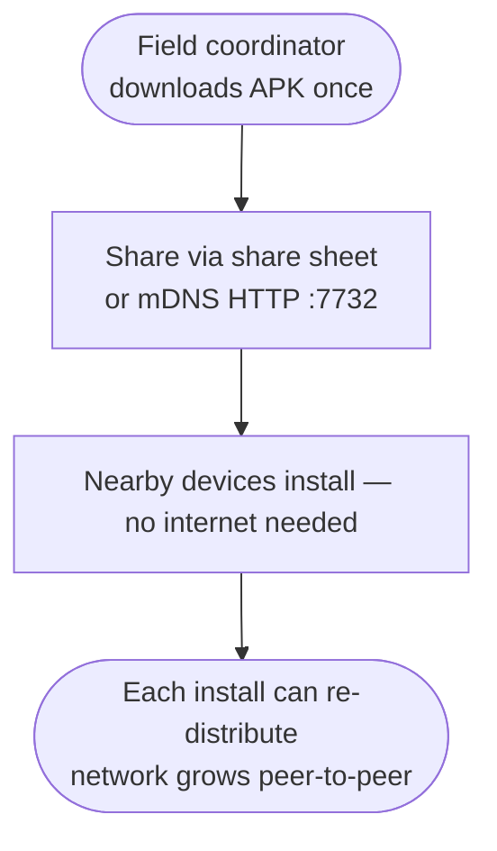
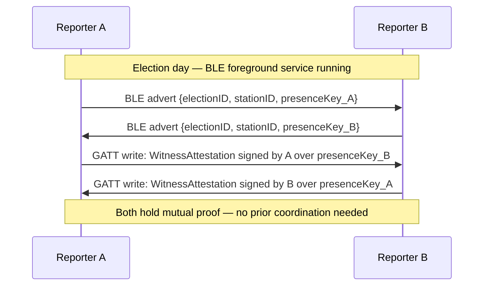
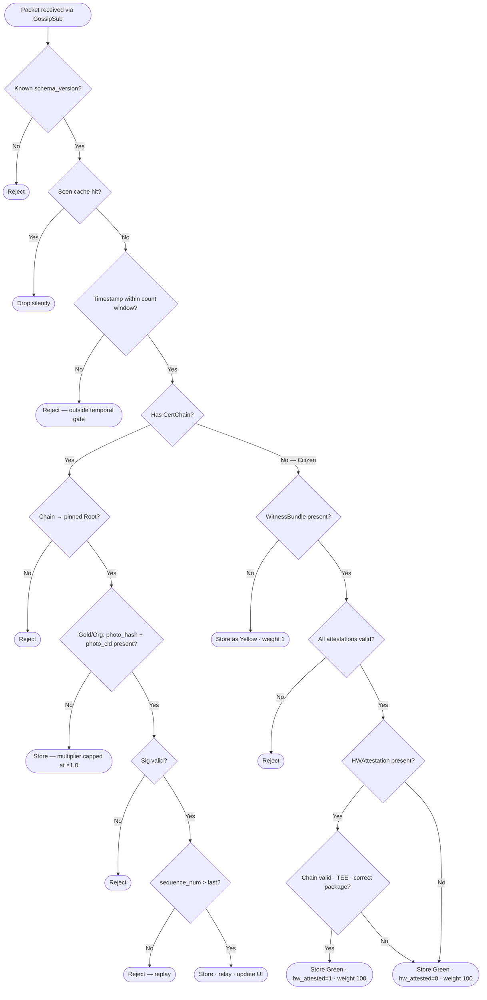

# PeerPulse — Elections Protocol Specification

**Version:** 7.0
**Pillar:** Elections (election observation)
**Architecture:** Decentralised P2P (js-libp2p v3) + BLE Station Presence + Hardware Attestation + Multi-Party PKI
**Trust model:** → see `spec-trust.md`
**Operations:** → see `../spec-operations.md`
**Strategy:** → see `../spec-strategy.md`
**Product overview:** → see `../product-overview.md`

---

## 1. Overview

Tabulate is PeerPulse's election observation pillar. Citizens independently count and co-sign official election tallies at polling stations. Physical co-presence — proven by BLE mutual attestation, live GPS, and hardware-backed device keys — is the trust mechanism. No pre-coordination required.

→ For the full product context and four-pillar overview, see `../product-overview.md`.

---

## 2. Core Architectural Pillars

### 2.1 Applications

PeerPulse ships as two citizen-facing applications and one public website:

| App | Platform | Role |
|---|---|---|
| **Mobile** | Expo Android | All citizen features — observation, surveys, BLE station presence, hardware attestation, APK self-distribution |
| **Desktop** | Electron | All infrastructure features — war room, network map, relay management, tally centre |
| **Website** | Next.js · `peerpulse.app` | Public marketing and protocol site — press, APK download, whitepaper, live election index, B2G landing |

No citizen-facing PWA. The public website handles all web functions: public marketing, APK distribution, and authenticated monitoring surfaces for operators and B2G partners.

No iOS. Android is 80–90%+ in all target markets.

### 2.2 Shared Protocol Core

All apps consume `@peerpulse/core` — a shared TypeScript library containing the full protocol: packet schema, trust validation, dispute resolution, and cryptographic primitives. One change propagates to all apps automatically.

### 2.3 Citizen-First, Authority-Optional

The app is fully functional with zero official participation. Crowdsourced Green-badge tallies, online surveys, and station status signals all work from day one. Official Gold and Organisation badges layer on as governments and NGOs adopt.

### 2.4 BLE-Primary Station Presence

Presence attestation is automatic and requires no pre-coordination. When a user starts witnessing at a station, the app starts an Android foreground service that advertises and scans via BLE. Any PeerPulse user at the same station entrance is automatically discovered. Mutual presence attestations are exchanged silently. When the tally is submitted, all BLE-discovered station peers are included in the `WitnessBundle`.

Citizens observe from the **public station entrance** — the legally mandated area where results are posted after counting. No accreditation is required to stand at the entrance. The BLE session accumulates co-presence proof across the entire closing-and-counting window, not just the moment of result capture.

### 2.5 Hardware Attestation for Tally Origin Proof

Session keys are generated inside the device's Trusted Execution Environment via Android Keystore. The TEE produces a hardware attestation certificate chain rooted in Google's Hardware Attestation Root CA. This chain, bundled into the `TallyPacket`, proves the key was generated on real Android hardware running the genuine PeerPulse app. Verification is fully offline — the root CA public key is pinned at build time.

Android Keystore supports Ed25519 hardware-backed keys only from API 33. `minSdkVersion` is 24. The **two-key architecture** resolves this: a hardware-backed ECDSA P-256 key (API 26+) is attested by the Keystore and signs the Ed25519 session public key. The Ed25519 key signs the packet payload. Verifiers check the full chain: attestation → ECDSA key in TEE → ECDSA signed this Ed25519 key → Ed25519 signed this payload.

Huawei and de-Googled Android devices without Google Play Services cannot produce chains rooted in Google's Hardware Attestation Root CA. These devices fall back to BLE-only trust: their `TallyPackets` carry `hw_attestation = null` and receive trust weight based solely on their `WitnessBundle`. Hardware attestation is an additive signal, not a binary gate.

### 2.6 libp2p for All Data Transport

All packet gossip travels over js-libp2p v3 GossipSub using WebSocket and TCP transports. BLE carries only presence attestations — not data payloads. Data moves through the P2P network.

### 2.7 APK Self-Distribution

The mobile app shares its own APK to nearby devices via Android share sheet or local mDNS HTTP server on port 7732. One person downloads it once; from there it propagates without touching peerpulse.app. The app is its own distribution network.

### 2.8 Offline-First on Shared Wi-Fi

Nodes on the same local network discover each other via mDNS and gossip over TCP with no internet required. Internet connectivity adds reach via Sovereign Relays, not correctness.

---

## 3. System Architecture



---

## 4. Technical Stack

| Layer | Component | Notes |
|---|---|---|
| **Mobile** | Expo SDK 55 · Android · Dev Build | Not Expo Go — native modules require Dev Build; dev APK built via Docker (ubuntu:22.04 + Android SDK + NDK r27) |
| **Desktop** | Electron + React renderer | `apps/desktop` — standalone React app inside Electron; connects to relay via libp2p WS |
| **Website** | Next.js 15 · App Router · TypeScript | `apps/web` · peerpulse.app · PeerPulse node (server-side + client-side libp2p); ISR election pages |
| **Relay** | Node.js 22 (`apps/node`) | Headless libp2p relay + info HTTP endpoint |
| **Language** | TypeScript 5.x strict | All apps and packages |
| **Monorepo** | pnpm workspaces + Turbo 2 | `apps/mobile`, `apps/node`, `apps/web`, `apps/desktop`, `packages/core` |
| **Networking** | js-libp2p v3 | WebSocket + TCP + BLE, GossipSub, Circuit Relay v2, mDNS |
| **React Native** | 0.79.7 (New Architecture) | Bridgeless JSI enabled by default |
| **React** | 19.2.6 | Mobile + Web + Desktop |
| **Crypto** | `@noble/curves`, `@noble/hashes` | Pure JS, Hermes-compatible |
| **Serialisation** | `protobufjs` | Versioned binary packets |
| **Storage** | `expo-sqlite` (mobile) · `better-sqlite3` (desktop) | Append-only schema |
| **BLE** | `react-native-ble-plx` | Station presence |
| **Hardware Attestation** | Android Keystore API (TEE/StrongBox) · `react-native-keychain` | ECDSA P-256 device key + Google HW Attestation Root CA |
| **PKI** | CFSSL + HSM | Certificate Authority, hardware-backed root |
| **Build** | Docker (ubuntu:22.04 + Android SDK + NDK r27) + `./gradlew` | Release APK signed offline on air-gapped machine; no EAS cloud account; no code uploaded to third-party services |
| **Task runner** | Turbo 2 (`pnpm dev`) | TUI, dependency-ordered build + watch |
| **CI** | GitHub Actions | Typecheck, test, lint on PR |

### 4.1 Mobile Shim Stack (Hermes)

| Node.js API | Shim | Notes |
|---|---|---|
| `node:crypto` | `react-native-quick-crypto` v1.x + `@peculiar/webcrypto` | v1.x uses `@noble/curves` internally; requires `react-native-nitro-modules` + `react-native-quick-base64` |
| `node:net` | `react-native-tcp-socket` | RN 0.79 New Architecture compatible |
| `node:stream` | `stream-browserify` | Required by yamux and noise |
| `Buffer` | `@craftzdog/react-native-buffer` | Global patched in `shims/globals.ts` |
| `crypto.getRandomValues` | `react-native-get-random-values` | Must be first import in `index.js` |
| `CustomEvent` / `EventTarget` | `event-target-shim` | libp2p's internal event system |
| `Promise.withResolvers` | inline polyfill | libp2p v3 internals |
| `node:os`, `node:path`, `node:dns` | thin local shims | libp2p imports but doesn't deeply use |

Aliases applied in both `babel.config.js` and `metro.config.js`.

`expo-build-properties` plugin required in `app.json`: `compileSdkVersion 35`, `minSdkVersion 24`, `kotlinVersion 1.9.24`.

### 4.2 Relay Discovery

```
GET http://127.0.0.1:9876/  →  { peerId, wsAddr, addrs }
```

- Development: Next.js `next.config.ts` rewrites `/relay-info` → `http://localhost:9876/` so client components can fetch relay info without CORS issues.
- Production: relay runs behind nginx with TLS. Endpoint: `https://relay.peerpulse.app/info`.
- Fixed ports: WebSocket `:9090`, info endpoint `:9876`, configurable via `WS_PORT`.

### 4.3 GossipSub Topics

```
peerpulse/tally/1.0.0
peerpulse/intent/1.0.0
peerpulse/witness/1.0.0
peerpulse/heartbeat/1.0.0
peerpulse/survey/1.0.0
peerpulse/vote/1.0.0
peerpulse/election/1.0.0
peerpulse/revocation/1.0.0
```

Global topics keep relay memory bounded. Nodes filter by `election_id` inside the payload.

---

## 5. Codebase Structure

```
peerpulse/
├── pnpm-workspace.yaml
├── turbo.json
├── package.json
├── tsconfig.base.json             ← strict TS5, ES2022
│
├── apps/
│   ├── mobile/                    ← @peerpulse/mobile · Expo SDK 55
│   │   ├── src/
│   │   │   ├── screens/
│   │   │   ├── components/
│   │   │   ├── navigation/
│   │   │   └── services/          ← libp2p node, SQLite, BLE, hardware attestation
│   │   ├── shims/                 ← Hermes polyfills
│   │   ├── app.json
│   │   ├── eas.json
│   │   ├── metro.config.js
│   │   ├── babel.config.js
│   │   └── package.json
│   │
│   ├── node/                      ← @peerpulse/node · Sovereign Relay
│   │   ├── src/index.ts           ← libp2p relay + HTTP info endpoint
│   │   └── package.json
│   │
│   └── website/                   ← @peerpulse/website · Next.js 15 · peerpulse.app
│       ├── app/
│       │   ├── layout.tsx         ← root layout, metadata, OG defaults
│       │   ├── page.tsx           ← / landing
│       │   ├── how-it-works/
│       │   ├── whitepaper/        ← whitepaper.md rendered as HTML
│       │   ├── download/          ← APK + SHA-256 + F-Droid link
│       │   ├── elections/         ← live election index (ISR, pulls from relay)
│       │   │   └── [electionId]/  ← per-election status page
│       │   ├── press/             ← press kit, contact
│       │   ├── relay/             ← community relay operator docs
│       │   └── protocol/          ← protocol reference docs
│       ├── components/
│       ├── lib/
│       │   └── relay.ts           ← read-only relay client for live election data
│       ├── public/
│       │   └── apk/               ← APK binary + SHA-256 checksum file
│       ├── next.config.ts
│       ├── tailwind.config.ts
│       └── package.json
│
└── packages/
    └── core/                      ← @peerpulse/core
        ├── src/
        │   ├── packets/           ← TypeScript types (all packet shapes)
        │   ├── crypto/            ← Ed25519 + ECDSA P-256, attestation
        │   ├── dispute/           ← dispute resolution + tally aggregation
        │   ├── trust/             ← witness graph, weight model, confirmation states
        │   ├── validation/        ← packet + WitnessBundle + HW attestation checks
        │   └── index.ts
        ├── tsconfig.json
        └── package.json
```

---

## 6. Node Roles

| Role | App | Submit Tallies | BLE Station Presence | HW Attestation | Credential |
|---|---|---|---|---|---|
| **Citizen Observer** | Mobile only | Yes | Yes (auto on witnessing start) | Yes | Session keypair |
| **Organisation Observer** | Mobile / Desktop | Yes | Optional | Optional | Organisation leaf cert |
| **Authority** | Mobile / Desktop | Yes (official) | Optional | Optional | Gold leaf cert |
| **Sovereign Relay** | `apps/node` | Routes only | No | No | PSK |

Any node with the packet schema can publish a valid `TallyPacket` — receiving nodes cannot distinguish a mobile-submitted packet from one submitted by arbitrary code if the signature is valid. Sybil resistance comes from the WitnessBundle (requires physical hardware at the station) and hardware attestation (requires TEE-backed key generation on real Android hardware). See `spec-trust.md` for the full weight model.

---

## 7. User Journeys

### 7.1 Citizen Observer Journey



### 7.2 BLE Station Foreground Service

When the user taps **Start Witnessing** (at the station entrance, near or after polls close):

1. `WitnessStartPacket` is signed and gossipped.
2. Android foreground service starts: *"Witnessing [Station Name] — tap to stop."*
3. Android Keystore TEE generates ECDSA P-256 device key. Attestation challenge = `SHA-256(election_id + station_id + nonce)`. TEE produces hardware attestation certificate chain.
4. TEE-backed ECDSA key signs the Ed25519 session public key → `session_key_sig`.
5. **Live location tracking begins** via `expo-location`. GPS sampled continuously, held in memory. Not stored or transmitted until submission.
6. Service advertises BLE payload: `{ election_id, station_id, presence_pub_key }`. No PII.
7. Service scans for matching advertisements from other PeerPulse users at the same station entrance.
8. On discovery, devices exchange `WitnessAttestation` entries over BLE GATT.
9. Discovered peers appear in the UI as live co-witnesses with a running count.
10. **Submission gate:** the primary *Submit Tally* button is locked until witness count reaches `ElectionDefinition.min_witnesses` (default: 1). The UI shows live progress: *"Witnesses: 2 / 3 — keep the app open."*
11. A secondary *Submit without witnesses* path is always available, explicitly labelled as an unverified (Yellow) submission with a warning.
12. Service stops on submission, explicit Stop, or 24 hours after `election_date`.

**Observation model:** Citizens stand at the public station entrance. Under Kenya's Elections (General) Regulations 2012 (and equivalent provisions in other target jurisdictions), the presiding officer must post the results form at the public entrance after counting. Citizens photograph the posted form; no access to the counting room is required. BLE co-presence attestations are exchanged among observers gathered at the entrance.

On tally submission:
- All BLE attestations attached as `WitnessBundle`
- `HWAttestation` bundle attached as proof of hardware origin
- **All tiers**: live GPS coordinate at moment of submission written to `photo_lat` / `photo_lng` / `photo_taken_at`. Receiving nodes validate against `station.plausibility_radius_m` — submissions outside the radius are rejected.
- **Gold/Org additionally**: app launches `expo-camera` to capture a photo of the physical tally sheet. **Gallery upload is not permitted.** GPS at capture time is embedded in EXIF and in the signed TallyPacket fields.

### 7.3 Opinion Poll Journey



### 7.4 APK Distribution Journey



### 7.5 Election Day Notifications

Users who have submitted an `IntentPacket` for a station receive push notifications on election day, timed against `ElectionDefinition.polls_close_time`. Notifications are scheduled locally on-device when the `ElectionDefinition` is received — no server call required on election day.

| Trigger | Message | Action |
|---|---|---|
| T−2h before `polls_close_time` | *"Surveys close at [time] at [Station Name]. Head there now to witness the count."* | Opens station map |
| T−15m before `polls_close_time` | *"Surveys closing soon at [Station Name]. Are you on your way?"* | Opens witnessing screen |
| `polls_close_time` | *"Surveys have closed at [Station Name]. Counting is beginning. Tap when you arrive."* | Opens Start Witnessing |
| First `WitnessStartPacket` or `TallyPacket` seen on network for this station | *"Observers are at [Station Name]. Results may be coming — are you there?"* | Opens witnessing screen |

The network-triggered notification (last row) fires only if the user has not already started witnessing. It acts as a signal that counting has concluded and results may be imminent.

---

## 8. Pre-Election Registry

```protobuf
message ElectionDefinition {
  string           election_id                = 1;
  string           name                       = 2;
  string           jurisdiction               = 3;
  int64            election_date              = 4;
  int64            registration_deadline      = 5;
  repeated Station stations                   = 6;
  uint32           dispute_threshold          = 7;   // default 5
  bytes            publisher_cert             = 8;
  bytes            signature                  = 9;
  int64            org_registration_deadline  = 10;  // cutoff for Org cert applications
  uint32           min_witnesses              = 11;  // witness gate before Submit unlocks; default 1
  int64            polls_close_time           = 12;  // Unix timestamp when polls close — drives election day notifications
}

message Station {
  string station_id            = 1;
  string name                  = 2;
  double lat                   = 3;
  double lng                   = 4;
  uint32 plausibility_radius_m = 5;   // default 200; increase for rural stations
}
```

### 8.1 Voter Registration Display

1. **Scan voter QR** — govt-issued voter card encodes `{ voter_id, station_id, election_id }`. Decoded locally. No voter ID is transmitted in any packet.
2. **Manual search** — name/ID search against `ElectionDefinition.stations` if no QR.

---

## 9. Presence Protocol

### 9.1 BLE Station Discovery



### 9.2 Session Keypair Lifecycle

- Generated on-device when a reporter starts witnessing at a station.
- Scoped to `(election_id, station_id, date)`. Cannot be reused across elections or stations.
- Generated inside the TEE via Android Keystore. Non-exportable. Attestation challenge binds the key to this election and station.
- Private key never leaves the device.
- Discarded 24 hours after `election_date`.

### 9.3 WitnessBundle Schema

```protobuf
message WitnessBundle {
  repeated Witness witnesses = 1;
}

message Witness {
  bytes presence_pub_key = 1;
  bytes attestation_sig  = 2;   // signs {other_keys[], station_id, session_window}
  int64 session_window   = 3;   // Unix timestamp — 4h window
}
```

---

## 10. Station Status Model

| Signal | Packet | Phase | Notes |
|---|---|---|---|
| Going to Vote | `IntentPacket` | Pre-election | Cumulative count |
| Witnessing | `WitnessStartPacket` | Election day | Cumulative count |
| Observing Now | `ObserveHeartbeat` | Live · 60s TTL | Live count |
| BLE Witnesses Present | BLE discovery | Election day | Live count of PeerPulse devices at this station entrance |
| Tallies Submitted | `TallyPacket` | Post-close | Count + dispute status |

---

## 11. Full Packet Schema

```protobuf
syntax = "proto3";

// ── Station observation ────────────────────────────────────────────────────

message TallyPacket {
  Header        header         = 1;
  Payload       payload        = 2;
  bytes         signature      = 3;   // Ed25519 over header+payload
  CertChain     cert_chain     = 4;   // empty for Citizen Observers
  WitnessBundle witnesses      = 5;
  bytes         photo_hash     = 6;   // SHA-256 of tally sheet photo (mandatory for Gold/Org)
  HWAttestation hw_attestation = 7;   // hardware origin proof
  string        photo_cid      = 8;   // IPFS CID of encrypted photo + metadata (mandatory for Gold/Org)
  double        photo_lat      = 9;   // GPS latitude at photo capture (mandatory for Gold/Org)
  double        photo_lng      = 10;  // GPS longitude at photo capture (mandatory for Gold/Org)
  int64         photo_taken_at = 11;  // Unix timestamp of photo capture (mandatory for Gold/Org)
}

message Header {
  uint32 schema_version = 1;
  string network_id     = 2;
  string election_id    = 3;
  int64  timestamp      = 4;
  bytes  nonce          = 5;   // 16 random bytes
}

message Payload {
  string station_id   = 1;
  string candidate_id = 2;
  uint64 vote_count   = 3;
  uint32 sequence_num = 4;
}

// Proves TallyPacket originated from real Android TEE hardware
message HWAttestation {
  bytes          device_cert     = 1;   // ECDSA P-256 leaf cert from Android Keystore TEE
  repeated bytes chain          = 2;   // cert chain to Google HW Attestation Root CA
  bytes          session_key_sig = 3;   // ECDSA P-256 sig over Ed25519 session public key
  // Attestation challenge embedded in device_cert extension:
  // SHA-256(election_id + station_id + nonce)
}

message IntentPacket {
  string election_id    = 1;
  string station_id     = 2;
  string role           = 3;   // "reporter" | "observer"
  int64  declared_at    = 4;
  bytes  device_pub_key = 5;
  bytes  signature      = 6;
}

message WitnessStartPacket {
  string election_id      = 1;
  string station_id       = 2;
  int64  witnessed_at     = 3;
  bytes  presence_pub_key = 4;
  bytes  signature        = 5;
}

message ObserveHeartbeat {
  string election_id    = 1;
  string station_id     = 2;
  int64  timestamp      = 3;
  bytes  device_pub_key = 4;
  // Ephemeral — not signed, 60s TTL
}

// ── Opinion surveys ──────────────────────────────────────────────────────────

message DemographicCriteria {
  repeated string age_ranges   = 1;
  repeated string regions      = 2;   // ISO 3166-2
  repeated string genders      = 3;
  repeated string occupations  = 4;
  repeated string languages    = 5;   // BCP 47
}

message SurveyDefinition {
  string               survey_id      = 1;
  string               question     = 2;
  repeated SurveyOption  options      = 3;
  int64                opens_at     = 4;
  int64                closes_at    = 5;
  string               eligibility  = 6;   // "open" | "witnessed" | "credentialed"
  uint32               min_witnesses= 7;
  DemographicCriteria  targeting    = 8;
  string               creator_org  = 9;
  bytes                creator_cert = 10;
  bytes                signature    = 11;
}

message SurveyOption {
  string option_id    = 1;
  string option_label = 2;
}

message VotePacket {
  string        survey_id               = 1;
  string        option_id             = 2;
  int64         cast_at               = 3;
  bytes         nonce                 = 4;
  bytes         device_pub_key        = 5;
  bytes         signature             = 6;
  WitnessBundle eligibility_witnesses = 7;
}

// ── PKI ────────────────────────────────────────────────────────────────────

message RevocationPacket {
  string revoked_key_id = 1;
  string reason         = 2;
  int64  revoked_at     = 3;
  bytes  signature      = 4;   // requires 2-of-5 root co-signers
}

message ElectionDefinition { /* see Section 8 */ }
message WitnessBundle      { /* see Section 9.3 */ }

message CertChain {
  bytes          leaf_cert = 1;
  repeated bytes chain     = 2;
}
```

---

## 12. Surveys

Poll targeting and the demographic profile model are specified in the Surveys pillar.

→ See `../surveys/spec-surveys.md`

---

## 13. PKI & Identity

### 13.1 Certificate Hierarchy

```
MasterRoot  (HSM · 3-of-5 threshold)
├── GovernmentSubCA  (2-year TTL)
│   └── OfficialLeaf  (30-day · device-bound · Gold)
└── ObserverSubCA  (2-year TTL)
    └── OrganisationLeaf  (30-day · device-bound · Organisation)
```

### 13.2 Root CA Key Holders

| # | Holder | Role |
|---|---|---|
| 1 | PeerPulse (vendor) | Operational key management |
| 2 | Contracting government | Sovereign stake |
| 3 | Independent audit firm | Third-party verification |
| 4 | Civil society observer | Designated by client |
| 5 | Escrow | Sealed · court-ordered release only |

Any credential issuance or root rotation requires 3-of-5 co-signatures.

### 13.3 Revocation

A `RevocationPacket` requires 2-of-5 root co-signers. On receipt, nodes add the key to a local denylist and retroactively downgrade all packets from that key to Yellow (Reported).

---

## 14. Hardware Attestation Verification

**Full verification chain (offline):**

```
1. Parse hw_attestation.chain
   → Verify X.509 chain roots to pinned Google HW Attestation Root CA

2. Check attestation extension (OID 1.3.6.1.4.1.11129.2.1.17):
   → security_level ≥ TEE  (reject: Software)
   → package_name = "app.peerpulse"
   → signing_cert_hash = pinned PeerPulse APK signing key fingerprint
   → attestation_challenge = SHA-256(election_id + station_id + nonce)

3. Verify session_key_sig
   → ECDSA P-256 verify using public key from device_cert
   → Over: Ed25519 session public key from TallyPacket

4. Verify TallyPacket.signature
   → Ed25519 verify using session public key
   → Over: header + payload
```

All four steps are fully offline. No network call required.

**Failure handling:**

| Failure | Treatment |
|---|---|
| `hw_attestation` absent | Packet stored as Green or Yellow (BLE witnesses determine tier) |
| `security_level = Software` | `hw_attested = 0`; trust weight unchanged |
| Wrong `package_name` or `signing_cert_hash` | Packet rejected |
| Challenge mismatch | Packet rejected |
| Chain does not root to pinned CA | `hw_attested = 0`; Huawei/de-Googled fallback |

---

## 15. Local Packet Validation



---

## 16. APK Self-Distribution

**Via Android share sheet:**
```typescript
const apkPath = await getApplicationApkPath();
const uri     = await getFileProviderUri(apkPath);
await Share.share({ url: uri, mimeType: 'application/vnd.android.package-archive' });
```

**Via local mDNS HTTP server:**
```
_peerpulse-install._tcp.local  :7732
Device B → http://[device-a-ip]:7732 → downloads APK → installs
```

Active only while the Share screen is open. Separate from the libp2p swarm.

APK signing key custody: see `spec-strategy.md §3`.

---

## 17. Data Persistence

Append-only SQLite. No UPDATE or DELETE on core packet tables.

```sql
CREATE TABLE elections (
  election_id   TEXT PRIMARY KEY,
  name          TEXT NOT NULL,
  election_date INTEGER NOT NULL,
  trust_tier    TEXT NOT NULL,
  raw_proto     BLOB NOT NULL
);

CREATE TABLE tallies (
  packet_id      TEXT PRIMARY KEY,
  election_id    TEXT NOT NULL,
  station_id     TEXT NOT NULL,
  candidate_id   TEXT NOT NULL,
  vote_count     INTEGER NOT NULL,
  witness_count  INTEGER NOT NULL DEFAULT 0,
  effective_weight INTEGER NOT NULL DEFAULT 0,
  trust_tier     TEXT NOT NULL,             -- 'gold' | 'organisation' | 'green' | 'yellow'
  org_id         TEXT,                      -- for entity deduplication (Gold/Org only)
  hw_attested    INTEGER NOT NULL DEFAULT 0,
  photo_hash     BLOB,
  photo_cid      TEXT,
  dispute_status TEXT NOT NULL DEFAULT 'leading',
  received_at    INTEGER NOT NULL,
  raw_proto      BLOB NOT NULL
);

CREATE TABLE poll_votes (
  packet_id  TEXT PRIMARY KEY,
  survey_id    TEXT NOT NULL,
  option_id  TEXT NOT NULL,
  device_key TEXT NOT NULL,
  cast_at    INTEGER NOT NULL,
  raw_proto  BLOB NOT NULL,
  UNIQUE(survey_id, device_key)
);

CREATE TABLE revocations (
  key_id     TEXT PRIMARY KEY,
  revoked_at INTEGER NOT NULL,
  raw_proto  BLOB NOT NULL
);

CREATE TABLE seen_cache (
  packet_id TEXT PRIMARY KEY,
  seen_at   INTEGER NOT NULL
);

CREATE TABLE device_profile (
  key   TEXT PRIMARY KEY,
  value TEXT NOT NULL
);

CREATE INDEX idx_tallies_station  ON tallies(election_id, station_id);
CREATE INDEX idx_tallies_dispute  ON tallies(dispute_status);
CREATE INDEX idx_tallies_attested ON tallies(hw_attested);
CREATE INDEX idx_tallies_org      ON tallies(org_id);
CREATE INDEX idx_poll_votes_poll  ON poll_votes(survey_id);
```

---

## 18. Testing

### 18.1 Build Gates

| Gate | Test | Pass Criteria |
|---|---|---|
| **0** | libp2p WebSocket node connects to relay | Node starts, dials relay, receives peer ID within 10s |
| **1** | libp2p TCP LAN gossip | Two devices on same Wi-Fi exchange GossipSub message < 5s |
| **2** | BLE WitnessBundle | Two devices at same station auto-exchange attestations via BLE foreground service |
| **3** | TallyPacket e2e | Signed tally gossipped mobile → relay → desktop; dispute algo runs correctly |
| **5** | HW Attestation | TEE-generated keypair produces verifiable chain; offline verification passes; software key rejected |

Gates pass in order.

### 18.2 Cryptographic Validation Suite

| Case | Expected |
|---|---|
| Valid Gold tally with photo | Accepted, stored as gold, multiplier ×2.0 applied |
| Valid Gold tally without photo | Accepted, stored as gold, multiplier capped at ×1.0 |
| Payload bit-flip | Rejected at signature step |
| Expired timestamp | Rejected |
| Submission outside count window | Rejected — temporal gate |
| Unknown schema_version | Rejected |
| Replayed nonce | Dropped silently |
| Out-of-order sequence_num | Rejected |
| Revoked key | Rejected after RevocationPacket |
| Chain to wrong root | Rejected |
| Valid BLE WitnessBundle (3 witnesses) | Green, hw_attested=0 |
| Valid HW Attestation + BLE WitnessBundle | Green, hw_attested=1 |
| HW Attestation: security_level = Software | hw_attested=0, weight unchanged |
| HW Attestation: wrong package_name | Rejected |
| HW Attestation: wrong APK signing cert | Rejected |
| HW Attestation: challenge mismatch | Rejected |
| Tampered WitnessBundle attestation | Rejected |
| Duplicate VotePacket same device+survey | Second rejected |

### 18.3 Trust Model Tests

| Input | Expected |
|---|---|
| 1 Gold + 2 Orgs + 20 citizens, unanimous | CONFIRMED |
| Same station, all citizens TEE-attested, ≥10, unanimous, no Gold/Org | CITIZEN-CONFIRMED |
| Same station, all citizens, <10 Green, no Gold/Org | LEADING |
| 1 Gold to false tally, 15 TEE Green citizens to true tally, citizen weight ≥3× Gold | CITIZEN-CONFIRMED (Gold in runner cluster) |
| 1 Gold to false tally, 8 TEE Green citizens to true tally, citizen weight ≥3× Gold | LEADING (below 10-citizen quorum) |
| 2 Orgs same org_id, different tallies | Org slot invalidated |
| Non-main cluster submitter | ×0.1 orphan penalty applied |
| Lead weight ≥3× all challengers, Gold present | CONFIRMED |
| Lead weight <3× threshold | LEADING |
| Two clusters within threshold | CONTESTED |
| No cluster dominates | DEADLOCKED |

---

## 19. Success Metrics

| Metric | Target |
|---|---|
| Tally propagation — relay path | < 15 s |
| Tally propagation — LAN path | < 5 s |
| BLE station peer discovery | < 30 s from witnessing start |
| Malicious packet rejection | 100% |
| BLE attestation exchange | < 20 s automatic |
| Dispute detection | < 1 s after conflicting packet |
| RevocationPacket propagation | < 30 s |
| APK share via local HTTP | < 30 s to install on nearby device |
| HW attestation verification (offline) | < 500 ms per packet |
| Witness graph computation per station | < 100 ms |

---

## 20. Accessibility

All UI surfaces must meet **WCAG 2.1 Level AA**:
- Trust tier badges convey status through shape and label, not colour alone
- Dispute status includes text labels, not just icons
- All interactive elements reachable via TalkBack (Android)
- Minimum 4.5:1 contrast ratio for body text
- Demographic profile form fully skippable with one tap
- Accessibility audit required before any B2G demonstration

---

## 21. Out of Scope

- **Citizen-facing PWA** — permanently excluded; the monitoring functionality cannot be delivered via browser because governments can block domains
- **iOS** — permanently excluded; Android is 80–90%+ in target markets
- **Google Play Store** — excluded (see `spec-strategy.md §2`)
- **ZK vote anonymity** — future milestone (Semaphore or similar)
- **Cross-jurisdiction root federation** — future milestone
- **Gamified Civic Hub** — post-MVP
- **Mesh / LoRa radio** — not planned
- **Wi-Fi Direct large-record sync** — deferred pending BLE sync proving out
- **Play Integrity API** — excluded; requires Google Play Services, not viable for Huawei penetration in target markets

---

## 22. Open Questions

| # | Question |
|---|---|
| 1 | **HSM vendor** — AWS CloudHSM, Thales, or YubiHSM for root key shares? |
| 2 | **FROST vs Shamir** for threshold signing — FROST = standard Ed25519 output; Shamir = offline ceremony |
| 3 | **BLE attestation protocol** — full mutual key exchange over GATT vs hash-of-presence-key in advertisement |
| 4 | **DISPUTE_THRESHOLD default** — review against Uganda, Kenya, DRC threat models before first deployment |
| 5 | **Poll vote privacy disclosure** — legal must approve UX copy explaining pseudonymous voting before launch |
| 6 | **Election law review** — required per jurisdiction before targeting any specific market |
| 7 | **APK signing key custody** — backup procedure and rotation policy to be documented |
| 8 | **Relay count at launch** — minimum 3 Sovereign Relays; two in target country, one external |
| 9 | **Demographic data governance** — Organisation/Gold cert required to publish targeted surveys, or open to any signed publisher? |
| 10 | **BLE foreground service UX** — notification wording and battery impact disclosure for low-end devices |
| 11 | **First target election** — one specific election to anchor GTM; requires legal review of parallel tallying in that jurisdiction |
| 12 | **Swiss Foundation timing** — set up before or after first viral traction? |
| 13 | **Huawei attestation path** — investigate whether Huawei's TEE attestation (HUKS) can be supported as a secondary trusted root alongside Google's |
| 14 | **IPFS pinning strategy** — which relay nodes pin photo evidence, for how long, and who pays storage costs? |
| 15 | **Photo encryption key management** — threshold encryption for dispute review, or PeerPulse-held decryption key? |
