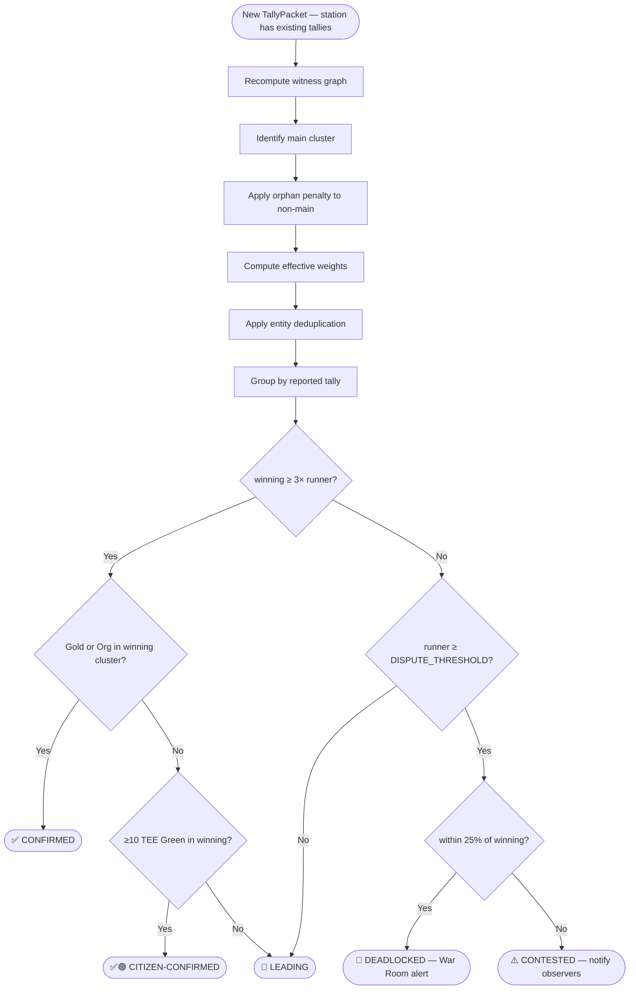

# PeerPulse — Elections Trust Model

**Version:** 7.0
**Pillar:** Elections (election observation)
**Depends on:** `spec-protocol.md` (packet schema, BLE, HW attestation)

---

## 1. Trust Tiers

### 1.1 Full Tier Table

| Tier | Badge | Role | Submits Tallies | Base Weight |
|---|---|---|---|---|
| Platform | 💎 Diamond | PeerPulse platform keypair — signs ElectionDef, PollDef only | No | — |
| Government | 🥇 Gold | Electoral commissions and official state bodies | Yes | 1000 |
| Organisation — NGO/CSO | 🔵 Org-NGO | Civil society, observer missions, accredited NGOs | Yes | 500 |
| Organisation — Press | 📰 Org-Press | Accredited media organisations and journalists | Yes | 500 |
| Organisation — Party | 🏛️ Org-Party | Registered political parties and their agents | Yes | 500 |
| Attested Citizen | 🟢 Green | Citizens with valid BLE WitnessBundle | Yes | 100 |
| Reported Citizen | 🟡 Yellow | Citizens without BLE attestation | Yes | 1 |

The Gold : Org : Green : Yellow ratio (1000 : 500 : 100 : 1) is calibrated against realistic observation density in target markets. In Kenya's 46,229 polling stations averaging 478 registered voters each, a high-mobilisation deployment fields roughly 15 PeerPulse-equipped citizens at a contested station's count. The Green base of 100 lets a 15-citizen cluster decisively override a single contradicting Gold submission via the connectivity boost (§4.4) without requiring photo participation, which empirically runs around 10% in safety-sensitive environments.

### 1.2 Diamond (Platform)

The official PeerPulse relay holds a persistent Ed25519 platform keypair. Diamond signs metadata packets only (`ElectionDefinition`, `SurveyDefinition`). A `TallyPacket` referencing the Diamond key is rejected. The Diamond public key is pinned in the mobile app at build time.

Community relay operators generate their own keypairs — not Diamond. Their `ElectionDefinition` packets display a warning until Gold/Organisation infrastructure is live.

### 1.3 Gold (Government)

Issued by PeerPulse via the GovernmentSubCA to verified electoral commissions and official state bodies. Gold leaf certs are device-bound, 30-day TTL. A Gold submission carries the highest base weight (1000) and anchors the main witness cluster. Only one Gold slot per electoral body (`org_id`) is counted per station, regardless of how many officials submit.

**Fees:** Setup fee of $10,000–20,000 per election (per commission), plus $300–500 per device cert (leaf) issued. See §3.1.

### 1.4 Organisation

Issued by PeerPulse via the ObserverSubCA. **Organisation certification is a paid, manually verified service.** PeerPulse is the sole issuer — self-service registration does not exist.

All three Organisation sub-tiers share the same base weight (500), the same PKI path (ObserverSubCA → OrganisationLeaf), and the same entity deduplication rules (one slot per `org_id` per station). They differ in certification requirements, fee structure, and how their submissions are displayed to users.

The leaf cert carries an `org_type` extension: `"ngo"` | `"press"` | `"party"`. Nodes use this field for UI rendering. Trust weight computation does not differentiate.

#### NGO/CSO

Eligible: civil society organisations, election observer missions, academic institutions, non-profit foundations with a verifiable public mandate. The standard Organisation tier.

**Fees:** $1,500–3,000 setup per election + $75–100 per device cert (leaf).

#### Press

Eligible: registered media organisations (newspapers, broadcasters, digital newsrooms) and individual journalists with demonstrable institutional affiliation. Lower fees reflect PeerPulse's interest in press coverage and independent reporting.

Press submissions are labelled with the outlet name in the UI. Not a partisan actor — no conflict-of-interest disclosure required.

**Fees:** $500–1,500 setup per election + $30–75 per device cert (leaf).

#### Political Party

Eligible: registered political parties participating in the target election. Any party may apply, including ruling party and opposition.

**Conflict-of-interest policy:** Party submissions are always rendered in the UI with the party name and affiliation visible. Nodes will never aggregate party submissions without that attribution. A confirmation state achieved only because the winning party's agents dominate — with the losing party(ies) submitting a contradicting tally — triggers an automatic CONTESTED override regardless of weight arithmetic. Multiple competing parties checking each other is the value; a single party dominating a station's tally without cross-party corroboration is not.

**Fees:** $3,000–8,000 setup per election + $100–200 per device cert (leaf). Higher than NGO to reflect party resources and the conflict-of-interest premium.

---

One weight slot (base 500) per `org_id` per station across all Organisation sub-tiers. Multiple observers from the same org must submit an identical tally; internal disagreement invalidates the org's slot for that station.

### 1.5 Green (Attested Citizen)

Any citizen who checks in, runs the BLE foreground service, and accumulates at least one valid mutual BLE attestation before submitting a tally. No registration required beyond on-device key generation. Green is the standard citizen tier and carries base weight 100.

**Photo is optional, not weight-bearing.** A Green submission with a photo (hash + IPFS CID + GPS at capture) carries the same base weight as a Green submission without a photo. Photos are valued as *human evidence* — they are pinned, surfaced on the dispute dashboard, and decrypted under threshold by auditors during dispute review — but they do not multiply citizen weight. The reason: realistic photo participation among citizens runs around 10% (low light, dead camera, storage full, safety concerns about being seen photographing), and gating override power on photos would push the citizen-override threshold beyond achievable observer density. Citizens who can safely photograph are encouraged to; citizens who cannot are not weight-penalised for it.

### 1.6 Yellow (Reported Citizen)

A citizen who submitted a tally with no valid WitnessBundle — either BLE was not available, they submitted remotely, or no other PeerPulse users were found at the station. Yellow submissions are recorded and visible on the dashboard but receive no connectivity boost and do not contribute toward any confirmation state.

---

## 2. PKI Hierarchy

```
MasterRoot  (HSM · 3-of-5 threshold)
├── GovernmentSubCA  (2-year TTL)
│   └── OfficialLeaf  (30-day · device-bound · Gold · org_id)
└── ObserverSubCA  (2-year TTL)
    └── OrganisationLeaf  (30-day · device-bound · org_id · org_type: ngo|press|party)
```

Diamond public key is pinned at build time — not issued via SubCA.

---

## 3. Organisation Certification

### 3.1 Issuance Process

**Gold:**
1. Electoral commission contacts PeerPulse via `contracts@peerpulse.app` with: official mandate documentation, jurisdiction, election name, number of devices to certify.
2. PeerPulse verifies via public government registry. Manual review required — no automated approval.
3. Setup fee invoiced and cleared before any certs issued.
4. Each device cert invoiced at per-leaf rate. GovernmentSubCA-signed OfficialLeaf issued per device; expires 30 days after `election_date`.

**Organisation (NGO, Press, Party):**
1. Organisation submits application via `certify@peerpulse.app` with: legal registration documents, org type (ngo/press/party), jurisdiction, election name, number of observer devices, contact (ProtonMail accepted).
2. PeerPulse manually verifies legal existence in-jurisdiction.
3. Political parties additionally required to provide: party registration certificate, list of designated agents by name (not required to be public-facing).
4. Setup fee invoiced and cleared before any certs issued.
5. Per-leaf fee invoiced for each device cert. 3-of-5 root co-signers issue ObserverSubCA-signed OrganisationLeaf cert with `org_type` extension.
6. Cert is device-bound and expires 30 days after `election_date`.

### 3.1a Fee Schedule

| Tier | Setup fee | Per leaf | Notes |
|---|---|---|---|
| 🥇 Gold | $10,000–20,000/election | $300–500/device | Per electoral commission. First election may be subsidised for trust-building. |
| 🔵 NGO/CSO | $1,500–3,000/election | $75–100/device | Standard civil society rate. |
| 📰 Press | $500–1,500/election | $30–75/device | Discounted to incentivise coverage. |
| 🏛️ Party | $3,000–8,000/election | $100–200/device | Conflict-of-interest premium. All registered parties eligible regardless of political alignment. |

Setup fee covers: manual verification, election-scoped org credential, cert revocation infrastructure for the election period. Per-leaf fee covers: 3-of-5 co-signer ceremony, device binding, cert issuance.

### 3.2 Registration Deadline

Each `ElectionDefinition` carries an `org_registration_deadline` field. Organisation certification applications submitted after this deadline are rejected for that election. Prevents last-minute onboarding fraud.

### 3.3 Cross-Election Reputation

Organisations accumulate a reputation score across elections:

| History | Weight applied |
|---|---|
| No prior elections | 60% of base weight (300 instead of 500) |
| 1 prior election, accurate | 80% of base weight |
| 2+ prior elections, accurate | Full base weight (500) |
| Prior outlier submissions flagged | Weight review required before next cert issuance |

"Accurate" is defined as: the org's tallies fell within the confirmed result cluster in ≥80% of the stations they submitted for.

### 3.4 Cross-Station Consistency Check

An Organisation whose submissions are outliers across many stations in the same election triggers an automatic flag for Diamond-tier review. Consistent outlier pattern indicates either a compromised key or a bad-faith observer — both warrant cert suspension and investigation.

---

## 4. Tally Aggregation Model

All tally weight computation for a station runs locally on each node after receiving a batch of `TallyPacket`s. The algorithm is deterministic — all honest nodes converge to the same result.

### 4.1 Witness Intersection Graph

For a given station, build a graph where:
- **Nodes** = all submitters (by presence_pub_key)
- **Edges** = two submitters are connected if they appear in each other's WitnessBundle (BLE is mutual, so edges are undirected)

### 4.2 Main Cluster Identification

Find all connected components. Rank by sum of raw base weights (no multipliers applied at this step). The component with the highest base weight sum is the **main cluster**.

If two components have equal base weight, the one with more submitters wins. Ties beyond that are resolved lexicographically by the lowest presence_pub_key in the component.

### 4.3 Orphan Penalty

Submitters in non-main components receive a **×0.1 penalty** applied to their effective weight. They remain in the aggregation and visible on the dashboard but cannot drive confirmation. This preserves all evidence while preventing isolated Sybil clusters from influencing results.

### 4.4 Connectivity Boost

For each submitter, compute **n** = count of fellow TallyPacket submitters for this station who appear in their WitnessBundle.

Effective weight formula by tier:

| Tier | Formula | Notes |
|---|---|---|
| Gold | `base × min(1 + log₂(n+1), 2.0)` | Requires photo_hash + photo_cid; without photo, cap is ×1.0 |
| Organisation | `base × min(1 + log₂(n+1), 2.0)` | Same photo requirement; entity-capped per org_id |
| Green | `base × (1 + log₂(n+1))` | Full log curve, no cap |
| Yellow | `base × 1.0` | No boost |

**Why Gold/Org are capped at ×2.0:** Institutional trust is established at onboarding, not through witness count. The ×2.0 cap confirms physical presence (n≥1 already hits the cap) without allowing compromised keys to gain disproportionate weight through high-n witness rings.

**Why Green gets the full log curve:** Witness connectivity is the citizen's entire trust mechanism. The curve creates strong incentive for BLE participation while making large-scale Sybil rings unprofitable due to diminishing returns.

**Log multiplier reference:**

| n (shared submitter-witnesses) | Multiplier |
|---|---|
| 0 | ×1.00 |
| 1 | ×2.00 |
| 3 | ×3.00 |
| 7 | ×4.00 |
| 15 | ×5.00 |
| 31 | ×6.00 |

**Worked example (citizen cluster overriding a contradicting Gold):**

15 Green citizens in one BLE cluster (n=14 each, multiplier ≈ 4.91), no Gold or Org in their cluster:
- Citizen cluster weight: 15 × 100 × 4.91 ≈ **7,365**
- One Gold submission to the contradicting tally (photo present, ×2.0): **2,000**
- Ratio 3.68× → satisfies the 3× confirmation rule
- Winning cluster has ≥10 TEE-attested Greens → **CITIZEN-CONFIRMED** (per §5.2)

This is the operational anchor: 15 honest TEE-attested citizens at one station can produce a green confirmation against an objecting Gold. Below 15 citizens, the protocol returns LEADING or CONTESTED; above 15, citizen evidence dominates.

### 4.5 Entity Deduplication

For Gold and Organisation submitters, group by `org_id` before summing weights. Each `org_id` contributes at most one base weight slot (1000 for Gold, 500 for Organisation) to any tally cluster. If multiple observers from the same org submit:
- **Unanimous agreement**: one slot counted at full effective weight
- **Any disagreement**: the org's slot is invalidated for this station

### 4.6 Photo Requirement for Gold/Org Multiplier

Gold and Organisation submitters must capture a photo of the physical tally sheet using the in-app camera. **Gallery upload is not permitted** — the app launches `expo-camera` directly, ensuring the photo is taken live and the GPS coordinate is fresh.

Required fields in `TallyPacket` for Gold/Org:
- `photo_hash` — SHA-256 of the photo file (commitment: prevents retroactive substitution)
- `photo_cid` — IPFS CID of the encrypted photo + EXIF metadata stored on relay nodes
- `photo_lat` / `photo_lng` — GPS coordinates from the foreground service live location tracking at moment of capture, signed as plaintext in the packet
- `photo_taken_at` — Unix timestamp of capture

All tiers must include `photo_lat`, `photo_lng`, and `photo_taken_at` — location is required for every TallyPacket regardless of tier. Every Android device has GPS; there is no exemption. Submissions failing the plausibility check are rejected.

Gold/Org additionally require `photo_hash` and `photo_cid`. Without those two fields, the Gold/Org submission is accepted but the connectivity boost cap is lowered from ×2.0 to ×1.0.

**Location plausibility check (enforced by all receiving nodes):**

```
distance(photo_lat, photo_lng, station.lat, station.lng) > station.plausibility_radius_m
→ photo fields treated as absent → multiplier capped at ×1.0
```

Default `plausibility_radius_m`: 200m (urban), configurable up to 1000m for rural stations in `ElectionDefinition`.

**What photos prove and don't prove:**

The photo is not machine-comparable across submitters — two photos of the same sheet produce different hashes at different angles and lighting. Photos serve as:
- **Commitment** — hash binds the submitter to a specific image at submission time
- **Physical presence signal** — you cannot photograph a tally sheet you are not standing in front of
- **Location corroboration** — GPS plausibility check adds a second physical presence signal independent of BLE
- **Human evidence** — decrypted during dispute resolution for side-by-side visual review

GPS spoofing is possible but requires running a spoof process alongside PeerPulse on a TEE-attested device — significantly raising attack complexity. Combined with BLE WitnessBundle, the two presence signals are independent attack surfaces.

---

## 5. Confirmation State Machine

### 5.1 States

| State | Symbol | Meaning |
|---|---|---|
| LEADING | 🔵 | One cluster is ahead but thresholds not yet met |
| CONFIRMED | ✅ | Result is confirmed with institutional corroboration |
| CITIZEN-CONFIRMED | ✅🟢 | Result confirmed by citizens; Gold/Org may be present but in losing cluster |
| CONTESTED | ⚠️ | Two clusters are competitive — alert sent to observers |
| DEADLOCKED | 🔴 | No cluster dominates — War Room alert |

### 5.2 Confirmation Algorithm

After computing effective weights per tally cluster:

```
let winning  = cluster with highest effective weight sum
let runner   = cluster with second highest effective weight sum

if winning.weight >= 3 × runner.weight:
  if winning contains ≥1 Gold or Organisation slot:
    → CONFIRMED
  elif winning contains ≥10 TEE-attested Green citizens:
    → CITIZEN-CONFIRMED   (Gold/Org may be present in the runner cluster)
  else:
    → LEADING  (insufficient participation for either confirmation type)
elif runner.weight >= DISPUTE_THRESHOLD:
  if |winning.weight - runner.weight| / winning.weight <= 0.25:
    → DEADLOCKED
  else:
    → CONTESTED
else:
  → LEADING
```

`DISPUTE_THRESHOLD` defaults to **50** (half of one Green base weight), configurable per election in `ElectionDefinition`. The threshold defines what counts as a credible challenger — anything below half a single citizen's base weight is not a meaningful dispute signal.

### 5.3 Minimum Quorum Rule

CONFIRMED requires at least one Gold or Organisation slot **in the winning cluster** — citizen weight alone cannot produce CONFIRMED. Without institutional corroboration in the winning cluster, the maximum achievable state is CITIZEN-CONFIRMED (subject to the TEE citizen threshold) or LEADING.

**Rationale:** The realistic attack surface at a polling station is not mass citizen fraud — citizens all watch the same physical count. The realistic attack is an insider (corrupt official or party agent) submitting a false tally. The quorum rule ensures that citizen submissions can either *corroborate* institutional submissions (CONFIRMED) or *override* them with decisive supermajority + presence proof (CITIZEN-CONFIRMED). The latter case is the politically loaded state: it indicates an institutional submission was contradicted by a strong citizen consensus.

### 5.4 CITIZEN-CONFIRMED

Applies in two scenarios:

1. **No institutional observer at the station** — common in rural or understaffed stations. Citizens alone provide all the evidence.
2. **Citizens decisively contradict an institutional submission** — Gold or Organisation is present but in the *runner* cluster (losing tally). Citizens in the winning cluster overrule by ≥3× weight margin.

Requirements (both scenarios):
- Winning cluster has ≥3× runner weight
- ≥10 Green citizens in winning cluster, all TEE-attested (`hw_attested = 1`)
- All 10+ must be in the main witness cluster (connected component)

CITIZEN-CONFIRMED is rendered distinctly on the dashboard — same green checkmark with a citizen badge. When the runner cluster contains a Gold or Organisation submission (scenario 2), the badge carries an *"institutional objection"* indicator surfacing that the citizen confirmation is over a contradicting institutional submission. This is the strongest evidence of institutional fraud the protocol produces — a publicly visible, cryptographically attested mass contradiction of an official tally — and the UI surfaces it explicitly rather than burying it.

Press and B2G partners can filter by confirmation type. A national result where 40% of stations are CITIZEN-CONFIRMED versus CONFIRMED is a visible signal of observer coverage; a result with CITIZEN-CONFIRMED-over-institutional-objection at scale is a visible signal of institutional fraud.

### 5.5 Split-Component Flag

If the main cluster identification step finds two components with base weight sums within 20% of each other, the station is flagged as **split-witness** regardless of the confirmation outcome. A split-witness flag triggers human review — it may indicate a large venue where BLE range split legitimate observers into two groups, or it may indicate an unusual pattern worth investigating.

---

## 6. Dispute Resolution

### 6.1 Algorithm



### 6.2 Evidence Window

After a station reaches CONFIRMED or CITIZEN-CONFIRMED, a **48-hour evidence window** opens. During this window:
- Any node can submit a contradicting `TallyPacket` with a valid photo hash pointing to a different result
- A valid contradicting submission reopens the result to CONTESTED
- After 48 hours with no valid contradiction, the result locks permanently

Photo hash is required to reopen a confirmed result — bare tallies cannot challenge a locked confirmation.

### 6.3 Photo Evidence Storage

Encrypted photos are stored on:
1. **IPFS** — content-addressed by CID, pinned by relay nodes
2. **Sovereign Relay nodes** — local cache for election duration + 90 days

Photos are encrypted with a threshold key (3-of-5 root co-signers required to decrypt). During dispute resolution, Diamond-tier operators or designated auditors may request decryption to view the physical tally sheet evidence.

---

## 7. Security Model

### 7.1 Realistic Threat Model

PeerPulse's threat model is grounded in how election fraud actually happens at counting stations. The mass-device attack (50 phones brought to a station) is theoretically analysable but operationally implausible at scale — the count is a public, witnessed event and everyone in the room sees the same physical tally sheet. Realistic threats are:

| Attack | Description | Primary Defence |
|---|---|---|
| **Insider fraud** | A legitimate official or party agent physically present submits a false tally | Photo hash (can't photograph a fake sheet in the room); citizen honest majority |
| **Remote phantom** | Someone submits a tally for a station they never attended | Photo hash (can't photograph a room you're not in); orphan penalty |
| **Onboarding fraud** | A fake Organisation certified before the election, deployed at scale | Registration deadline; jurisdiction verification; cross-election reputation; 3-of-5 issuance |
| **Compromised Org key** | A legitimate Org's key is stolen or coerced | Entity cap (one slot per org); revocation; cross-station consistency check |
| **Suppression** | Intimidation or phone confiscation prevents honest submissions | Offline queue; BLE relay; social/legal — out of protocol scope |

### 7.2 Honest Majority Principle

Within the citizen tier, the PeerPulse aggregation model guarantees: **if the majority of citizens physically present at a station submit honestly, the correct result wins.**

Proof: Within a connected BLE component, all citizens have n ≈ (total_submitters − 1). The log multiplier is therefore identical for all members of that component. Effective weight per citizen = 10 × f(n), a constant across honest and dishonest alike. The winning tally is determined by submitter count alone — a pure majority vote. Honest majority in count → honest majority in weight → correct result.

This holds regardless of whether dishonest citizens BLE with honest ones (same multiplier, count vote) or form their own cluster (orphan penalty further reduces their weight).

The principle breaks only if both the citizen majority AND the institutional tier (Gold/Org) at the same station are simultaneously corrupt — operationally implausible in a normal counting environment where party agents from opposing parties are present.

### 7.3 Cost of Attack at Scale

The TEE hardware attestation requirement prices out software Sybil attacks. Physical device farms (real Android hardware) cost $150–300 per device. At 10,000 stations with 50 devices per station, a nationwide physical infiltration attack costs $75–150M in hardware alone, requires coordinated physical presence at every station simultaneously, and every participant is a potential defector.

The mass infiltration scenario that the weight formula is designed to resist is therefore primarily a stress test of the model's mathematical properties — not the operational threat model. The operational defences (photo hash, TEE, cross-station consistency) close the realistic attacks.
