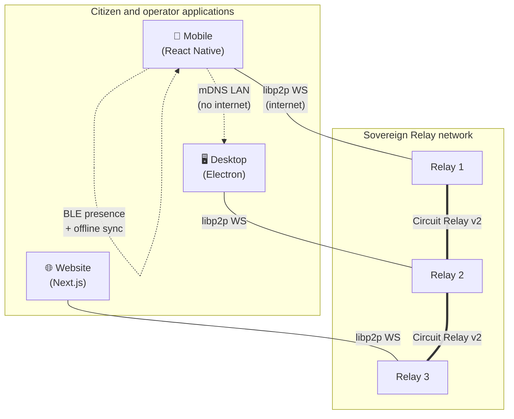
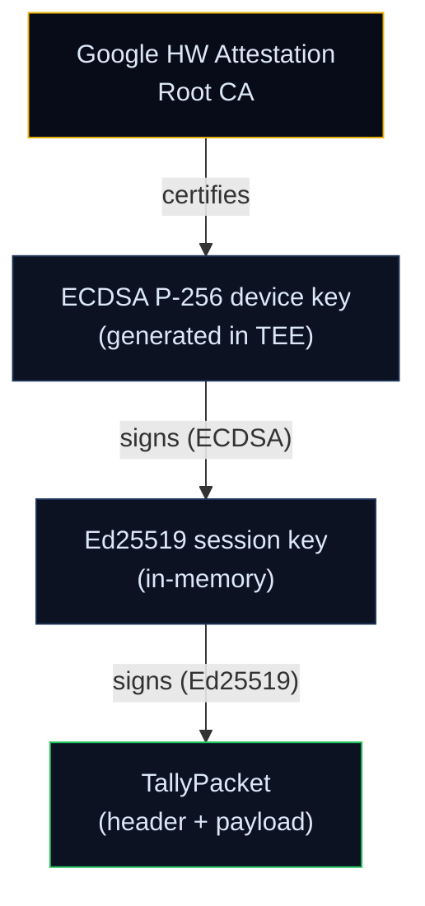
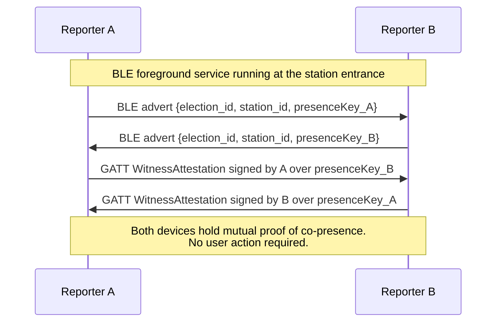
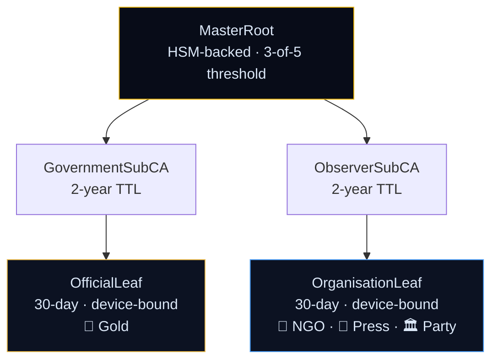
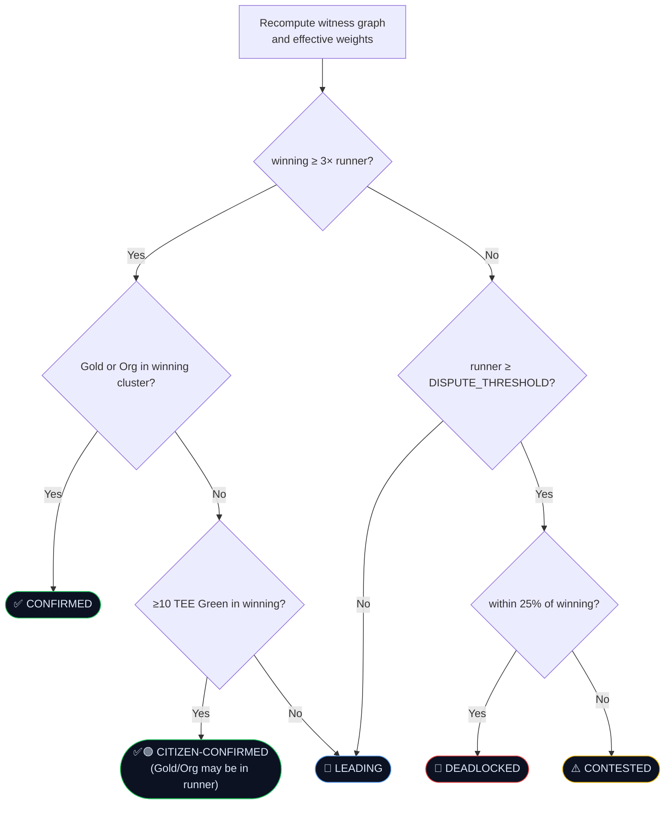
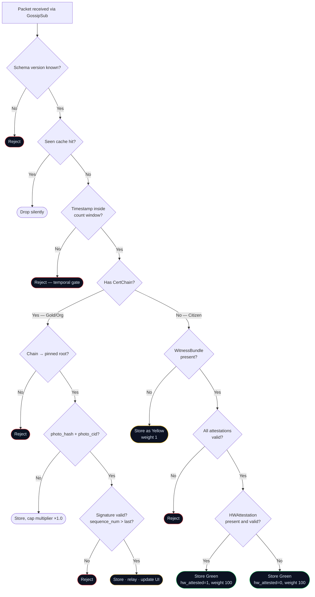

# PeerPulse: Decentralised Civic Intelligence

**A Peer-to-Peer Protocol for Election Verification, Civic Polling, and Government Transparency**

*Version 7.0, May 2026*

*Announced first deployment: Kenya General Election, 10 August 2027*

## Abstract

The central problem in election integrity is establishing ground truth in an adversarial environment. Existing approaches depend on a central authority, a trusted server, an accredited observer body, or an official commission, that can be pressured, corrupted, or shut down. Each shares a single point of failure: a human institution that can be compelled.

PeerPulse describes a different model. When a citizen photographs the official tally sheet posted at the public entrance of their polling station, their device produces three independent cryptographic proofs of physical presence: a hardware attestation showing the signing key was generated in a real Android Trusted Execution Environment, a witness bundle of mutual Bluetooth Low Energy attestations exchanged with other co-located observers, and GPS coordinates within a defined radius of the station. When many citizens independently produce such tallies for the same station and agree on a number, the agreement is significantly harder to fabricate than any server-issued certificate. No pre-coordination is required. No organisation needs to accredit them.

This paper describes the PeerPulse protocol: a peer-to-peer system for election tally witnessing, targeted civic polling, AI-extracted neutral summaries of government proceedings, and civic education. We specify the packet schema, the seven-tier trust hierarchy, the BLE presence ceremony, the hardware attestation requirement, the photo-and-location evidence model, the witness-graph dispute resolution algorithm, and the threat model. We also describe three strategic properties the architecture creates, legitimacy inversion, shutdown boomerang, and ban resistance, and why each makes cooperation with PeerPulse the rational choice for any government that expects to win fairly.

## 1. Introduction

### 1.1 The Problem

Democratic elections in contested environments face a consistent set of integrity challenges.

**Result manipulation at the tally centre.** Official counts are aggregated behind closed doors. Discrepancies between station-level tallies and reported national results are common in disputed elections and difficult to prove without distributed witnessing at scale.

**Observer suppression.** Accredited international observers cover a small fraction of polling stations. Local observers can be denied accreditation, physically removed, or intimidated. Their reports flow through central databases controlled by the same authorities whose conduct is under scrutiny.

**Communication blackouts.** Governments facing unfavourable results increasingly impose internet shutdowns during election periods. A monitoring system that requires internet connectivity fails at exactly the moment it is needed most.

**Centralised platforms as attack surfaces.** Applications that rely on a central server create a single target: the server can be seized, the domain can be blocked, the company can be legally compelled to hand over data, and the application can be removed from the app stores. The 2021 removal of Navalny's Smart Voting app from the Russian Google Play Store, days before a federal election, is the precise pattern this work is designed to defeat.

### 1.2 The Existing Landscape

Parallel Vote Tabulation (PVT) is the established methodology for independent election monitoring. Organisations such as ELOG in Kenya, YIAGA Africa in Nigeria, the National Democratic Institute internationally, and the Carter Center have refined PVT over decades. It works: a sufficiently large random sample of polling stations, each observed by a trained representative, produces a statistically reliable independent count.

The limitation is organisational. PVT requires a large trained observer corps, centralised data collection, and a credentialed organisation that can withstand government pressure. In the most contested environments, precisely where PVT is most needed, the organisational requirements become the binding constraint.

### 1.3 What PeerPulse Does

PeerPulse makes PVT-class witnessing available to any citizen with an Android device, without requiring a credentialed organisation, a central server, or internet connectivity. Critically, it requires no pre-coordination among observers. A citizen does not need to register with any organisation, attend any briefing, or arrange to meet any other observer before election day. They download the app, go to their polling station, and the protocol handles the rest.

The platform extends beyond election day. PeerPulse is organised as four interlocking pillars:

| Pillar | What it does | When |
|---|---|---|
| **Elections** | Citizens independently count and co-sign official tallies posted at the station entrance | Election day |
| **Surveys** | Governments and accredited organisations publish targeted opinion surveys to opted-in citizens; results aggregate pseudonymously on-device | Continuous |
| **Journal** | AI-extracted neutral summaries of parliamentary, executive, judicial, and budget proceedings, with citations to primary sources, translated to local languages | Continuous |
| **Learn** | Curated civic education content and quizzes, know your rights, understand how elections work, understand the budget process | Continuous |

Each pillar reinforces the others. A citizen who learns through Learn is more likely to submit a tally through Elections. A citizen who follows Journal knows what is at stake in an election. Surveys close the loop by letting organisations ask targeted questions of engaged citizens. Together they create a platform citizens open year-round, not only on election day.

This paper focuses primarily on the Elections pillar, where the cryptographic protocol is most developed. The other three pillars are summarised in §§9–11 and specified fully in their own documents.

## 2. Core Insight: Triple Presence as Proof

The central cryptographic primitive in PeerPulse is unusual: it is not a certificate from a trusted authority, but the convergence of three independent physical-presence signals, each automatically generated when a citizen captures the posted tally.

Consider election day at a polling station. Alice, Bob, and Carol each downloaded the PeerPulse app independently. They have never met. They are at the same station for their own reasons, as voters, as citizen journalists, as curious neighbours. Each opens the app at the station entrance, the area where, by law in the target jurisdictions, results must be posted after counting, and taps **Start Witnessing**.

Automatically, invisibly:

1. **Hardware attestation.** The device's Android Keystore generates a fresh signing key inside the Trusted Execution Environment. The TEE produces a certificate chain rooted in Google's Hardware Attestation Root CA, proving that the key was generated on real Android hardware running the genuine PeerPulse APK. The chain is bound to the specific election and station via an attestation challenge.

2. **BLE co-presence.** The device begins advertising and scanning over Bluetooth Low Energy. Other PeerPulse devices nearby are discovered. Mutual `WitnessAttestation` exchanges occur over BLE GATT, each device signs the other's public key. Neither side needs to know the other exists in advance.

3. **GPS plausibility.** Live location tracking begins. GPS samples are kept in memory and not transmitted until the tally is submitted. At capture time, the coordinates are embedded in the signed packet.

When the count concludes and the official tally is posted at the entrance, each citizen photographs it through the app. The submitted `TallyPacket` contains:

- The reported vote count
- A signature over the payload by an Ed25519 session key
- An ECDSA P-256 signature over that session key by the TEE-bound device key
- The hardware attestation certificate chain
- All BLE witness attestations accumulated since check-in
- The photo hash, GPS coordinates, and capture timestamp

A receiving node can verify, fully offline, that this report came from a real Android device that was physically present at this specific station, co-located with N other PeerPulse devices at the same time, and that the photograph commits the submitter to a specific image of the posted tally.

The power of this proof is not that the devices trust each other. They are strangers. The power is that fabricating it requires deploying real hardware to the correct location at the correct time, capturing a photograph of the posted tally, and producing a TEE-backed signature, all while sustaining mutual BLE attestation with other devices that an attacker does not control. A remote attacker with a laptop cannot replicate any of these properties. A local attacker with a phone farm faces logistical constraints that scale poorly against a genuine observer corps.

**No meeting before election day. No organisation. No accreditation. Just: show up, witness, submit.**

## 3. System Overview

### 3.1 Applications

PeerPulse ships as two citizen-and-operator applications and one public website, all consuming a shared protocol library:

| Application | Platform | Role |
|---|---|---|
| **Mobile** | Expo / React Native, Android only | All citizen features, observation, surveys, BLE station presence, hardware attestation, APK self-distribution |
| **Desktop** | Electron + React renderer | All infrastructure features, war room, network map, relay management, tally centre |
| **Website** | Next.js 15, `peerpulse.app` | Public marketing, APK download, whitepaper, live election index, B2G landing |

There is no citizen-facing web application. Web applications can be blocked by government DNS interference or network-level filtering. An Android APK distributed person-to-person is significantly harder to suppress than a website. The web app exists only as a public information and monitoring surface; it is never the path by which citizens participate in observation.

There is no iOS application. Android holds 80–90%+ market share in all primary target markets including Uganda, Kenya, DRC, Nigeria, Indonesia, and the Philippines. Maintaining an iOS port would dilute focus without expanding the addressable observer base.

### 3.2 Shared Protocol Core

All three applications consume `@peerpulse/core`, a TypeScript library containing the complete protocol: packet schema, trust validation, dispute resolution, witness-graph aggregation, hardware attestation verification, and cryptographic primitives. A change to the dispute algorithm propagates to all surfaces from a single source.

### 3.3 Network Topology



**Sovereign Relays** are Docker nodes running `apps/node` that route packets between applications using libp2p Circuit Relay v2. Any operator can run one. The protocol specifies their role, not their identity. Sovereign Relays additionally pin photo evidence to IPFS for the election period plus 90 days.

**mDNS on a shared local network** allows devices without internet to discover each other and gossip directly over TCP. A coordination centre Wi-Fi network with no internet is sufficient for the network to function.

**Bluetooth Low Energy** carries only cryptographic presence attestations and opportunistic offline sync of missing packets between physically near devices. All tally data ultimately travels over libp2p.

### 3.4 Citizen-First, Authority-Optional

The application is fully functional with zero official participation. Crowdsourced Green-tier tallies, online surveys signed by NGOs, Journal summaries, and station status signals all operate from day one. Gold and Organisation tiers layer on as governments and NGOs choose to participate. The protocol does not require institutional adoption to provide value, institutional adoption is the second-stage demand-pull, not the precondition for launch.

## 4. Elections: Protocol Specification

### 4.1 Packet Types

All data travels as signed Protobuf packets gossiped over libp2p GossipSub across eight global topics:

```
peerpulse/tally/1.0.0
peerpulse/intent/1.0.0
peerpulse/witness/1.0.0
peerpulse/heartbeat/1.0.0
peerpulse/survey/1.0.0
peerpulse/vote/1.0.0
peerpulse/election/1.0.0
peerpulse/revocation/1.0.0
```

Global topics keep relay memory bounded. Nodes filter by `election_id` inside the payload.

The relevant packet types for Elections are:

- **`ElectionDefinition`**: a signed description of an election: jurisdiction, date, station list, polls-close time, dispute threshold, minimum witnesses, organisation registration deadline.
- **`IntentPacket`**: a citizen's declaration of intent to observe a specific station, broadcast before election day. Drives the local notification schedule.
- **`WitnessStartPacket`**: broadcast when the user taps Start Witnessing at the station. Triggers the BLE foreground service.
- **`ObserveHeartbeat`**: a 60-second TTL signal indicating a device is currently active at a station. Unsigned and ephemeral; used only for the live observer count.
- **`TallyPacket`**: the citizen observer's record of the vote count at a polling station. The core data structure of the protocol.
- **`RevocationPacket`**: a revocation of a previously issued credential, requiring 2-of-5 root co-signatures.

### 4.2 The TallyPacket

```protobuf
message TallyPacket {
  Header        header         = 1;
  Payload       payload        = 2;
  bytes         signature      = 3;   // Ed25519 over header + payload
  CertChain     cert_chain     = 4;   // empty for Citizen Observers
  WitnessBundle witnesses      = 5;
  bytes         photo_hash     = 6;   // SHA-256 of tally sheet photo
  HWAttestation hw_attestation = 7;   // hardware origin proof
  string        photo_cid      = 8;   // IPFS CID of encrypted photo
  double        photo_lat      = 9;   // GPS latitude at photo capture
  double        photo_lng      = 10;  // GPS longitude at photo capture
  int64         photo_taken_at = 11;  // Unix timestamp of photo capture
}

message Header {
  uint32 schema_version = 1;
  string network_id     = 2;
  string election_id    = 3;
  int64  timestamp      = 4;
  bytes  nonce          = 5;          // 16 random bytes. replay prevention
}

message Payload {
  string station_id   = 1;
  string candidate_id = 2;
  uint64 vote_count   = 3;
  uint32 sequence_num = 4;
}
```

The Ed25519 `signature` field signs the canonical serialisation of `Header + Payload` using a session keypair generated inside the device's TEE. For credentialed observers (Gold / Organisation), the session key is additionally bound to a leaf certificate in `cert_chain`.

Every TallyPacket includes `photo_lat`, `photo_lng`, and `photo_taken_at`: location is required for every tier. Gold and Organisation submissions must additionally include a non-empty `photo_hash` and `photo_cid`; without those two fields, the institutional connectivity-boost multiplier is capped at ×1.0 (see §6.4).

### 4.3 Hardware Attestation

Android Keystore supports Ed25519 hardware-backed keys only from API 33. PeerPulse's `minSdkVersion` is 24. To bring TEE attestation to API 26+ devices, the protocol uses a **two-key architecture**:



A verifier checks the full chain: attestation → ECDSA key was generated in the TEE → ECDSA key signed this Ed25519 session key → Ed25519 session key signed this payload. Both signatures and the full certificate chain are bundled in `HWAttestation`.

```protobuf
message HWAttestation {
  bytes          device_cert     = 1;   // ECDSA P-256 leaf cert from Android Keystore TEE
  repeated bytes chain           = 2;   // cert chain to Google HW Attestation Root CA
  bytes          session_key_sig = 3;   // ECDSA P-256 sig over Ed25519 session public key
  // Attestation challenge embedded in device_cert extension:
  //   SHA-256(election_id + station_id + nonce)
}
```

The attestation challenge cryptographically binds the device key to a specific election and station. A device cannot reuse a TEE key generated for one election or station to sign tallies for another.

**Verification (offline):**

1. Parse `hw_attestation.chain`. Verify the X.509 chain roots to the pinned Google Hardware Attestation Root CA.
2. Check the attestation extension (OID 1.3.6.1.4.1.11129.2.1.17):
   - `security_level ≥ TEE` (reject `Software`)
   - `package_name == "app.peerpulse"`
   - `signing_cert_hash` matches the pinned PeerPulse APK signing key fingerprint
   - `attestation_challenge == SHA-256(election_id + station_id + nonce)`
3. Verify `session_key_sig` (ECDSA P-256) over the Ed25519 session public key.
4. Verify `TallyPacket.signature` (Ed25519) over `Header + Payload`.

All four steps are fully offline. The Google Hardware Attestation Root CA public key is pinned at build time.

**Huawei and de-Googled devices.** Devices without Google Play Services cannot produce chains rooted in Google's Hardware Attestation Root CA. These devices fall back to BLE-only trust: their TallyPackets carry `hw_attestation = null` and receive trust weight based solely on the BLE WitnessBundle. Hardware attestation is an additive signal, not a binary gate. A future revision may add Huawei HUKS attestation as a secondary trusted root.

### 4.4 The WitnessBundle

```protobuf
message WitnessBundle {
  repeated Witness witnesses = 1;
}

message Witness {
  bytes presence_pub_key = 1;
  bytes attestation_sig  = 2;   // signs {other_keys[], station_id, session_window}
  int64 session_window   = 3;   // Unix timestamp. 4-hour window
}
```

Each `Witness` entry represents one co-located observer. The `attestation_sig` is a signature by that observer's session key over the set of all other observers' public keys, the station ID, and the session window. This signature proves the signer was physically present with the others and observed their Bluetooth advertisements.

A WitnessBundle is valid if and only if:

- All attestation signatures verify against the declared presence public keys
- All session windows fall within the active count window for this station
- The station ID and election ID in each attestation match the TallyPacket header
- The reporter's own key does not appear in their own bundle entry (self-witnessing is invalid)

### 4.5 Photo and Location Evidence

Gold and Organisation submitters capture a photo of the physical tally sheet using `expo-camera` launched directly from the app. **Gallery upload is not permitted**: the photo must be taken live. GPS at capture time is embedded in EXIF and in signed TallyPacket fields.

The photo serves four distinct purposes:

- **Commitment.** The hash binds the submitter to a specific image at submission time. Substituting a different photo later would change the hash.
- **Physical presence signal.** A submitter who is not in the room cannot photograph the tally sheet posted in that room.
- **Location corroboration.** The GPS plausibility check provides a second presence signal independent of BLE, if a packet claims to be from a station but the GPS coordinate is 5km away, it is rejected.
- **Human evidence.** Photos are decrypted during dispute resolution for side-by-side visual review by designated auditors.

Photos are encrypted with a threshold key (3-of-5 root co-signers required to decrypt) and stored on IPFS, content-addressed by CID, pinned by Sovereign Relays for the election duration plus 90 days.

The photo is **not machine-comparable across submitters**: two photos of the same sheet, taken from different angles and under different lighting, produce different hashes. The protocol does not attempt automated photo agreement; the hash is a commitment, the photo is human evidence under dispute review.

**Location plausibility check** (enforced by all receiving nodes):

```
distance(photo_lat, photo_lng, station.lat, station.lng) > station.plausibility_radius_m
→ photo fields treated as absent → multiplier capped at ×1.0
```

Default `plausibility_radius_m` is 200m (urban), configurable up to 1000m for rural stations in `ElectionDefinition`. GPS spoofing on Android requires running a spoof process alongside PeerPulse on a TEE-attested device, significantly raising attack complexity. Combined with BLE WitnessBundle, the two presence signals are independent attack surfaces.

### 4.6 Session Keypair Lifecycle

Citizens use ephemeral session keypairs scoped to a single election and station. This limits the damage from key compromise and prevents cross-election linkability.

- Generated on-device when a citizen starts witnessing at a specific station.
- Scoped to `(election_id, station_id, date)`. The same key cannot be reused across elections or stations.
- The underlying ECDSA P-256 key lives inside the TEE and is non-exportable.
- Only the public key is shared, via Bluetooth advertisement. The private key never leaves the device.
- Discarded 24 hours after the election date.

## 5. BLE Station Presence

### 5.1 The Foreground Service

When the user taps **Start Witnessing** at the station entrance (near or after polls close):

1. A `WitnessStartPacket` is signed and gossipped.
2. An Android foreground service starts with a persistent notification: *"Witnessing [Station Name], tap to stop."*
3. Android Keystore generates the ECDSA P-256 device key inside the TEE. The attestation challenge is computed as `SHA-256(election_id || station_id || nonce)`.
4. The TEE-backed ECDSA key signs the Ed25519 session public key → `session_key_sig`.
5. Live location tracking begins via `expo-location`. GPS samples are kept in memory only.
6. The service advertises a BLE payload: `{ election_id, station_id, presence_pub_key }`. No personally identifying information is included.
7. The service scans for matching advertisements from other PeerPulse users at the same station entrance.
8. On discovery, devices exchange signed `WitnessAttestation` entries over Bluetooth GATT.
9. Discovered peers appear in the UI as live co-witnesses with a running count.
10. The service stops on submission, on explicit Stop, or 24 hours after `election_date`.



The foreground service additionally performs opportunistic GossipSub synchronisation over Bluetooth when two devices are physically near each other without internet access, missing tally records propagate person-to-person even during a network blackout.

### 5.2 The Submission Gate

The primary *Submit Tally* button is locked until the witness count reaches `ElectionDefinition.min_witnesses` (default: 1). The UI shows live progress: *"Witnesses: 2 / 3, keep the app open."* This nudges citizens toward producing higher-trust submissions while keeping the app usable when no other observers are present.

A secondary *Submit without witnesses* path is always available, explicitly labelled as an unverified (Yellow) submission with a warning. Yellow submissions are recorded and visible on the dashboard but cannot contribute to a confirmation state.

### 5.3 Observation Model

Citizens stand at the **public station entrance**: the legally mandated area where, in Kenya and equivalent jurisdictions, the presiding officer must post the results form after counting. No access to the counting room is required. No accreditation is required to stand at the entrance.

The BLE session accumulates co-presence proof across the entire closing-and-counting window, typically several hours from polls close to results posting, not only the moment of result capture. This produces a denser witness graph than any single-instant ceremony could.

### 5.4 No Pre-Coordination Required

The BLE presence model requires nothing from the observer before election day. There is no briefing to attend, no QR code to exchange in advance, no organisation to register with. An observer who has never heard of PeerPulse, who downloads the app the night before the election and starts witnessing at their station the next morning, will automatically accumulate co-witness attestations from any other PeerPulse users at that entrance.

This is the property that distinguishes the protocol from traditional PVT: **the cost of participation is near zero**. Any citizen who is already going to their polling station can contribute a witnessed tally.

## 6. Trust Model and Tally Aggregation

### 6.1 The Seven Tiers

| Tier | Badge | Role | Submits Tallies | Base Weight |
|---|---|---|---|---|
| Platform | 💎 Diamond | PeerPulse platform keypair, signs `ElectionDefinition`, `SurveyDefinition` only | No | - |
| Government | 🥇 Gold | Electoral commissions and official state bodies | Yes | 1000 |
| Organisation, NGO/CSO | 🔵 Org-NGO | Civil society, observer missions, accredited NGOs | Yes | 500 |
| Organisation, Press | 📰 Org-Press | Accredited media organisations and journalists | Yes | 500 |
| Organisation, Party | 🏛️ Org-Party | Registered political parties and their agents | Yes | 500 |
| Attested Citizen | 🟢 Green | Citizens with valid BLE WitnessBundle | Yes | 100 |
| Reported Citizen | 🟡 Yellow | Citizens without BLE attestation | Yes | 1 |

The Gold : Org : Green : Yellow ratio (1000 : 500 : 100 : 1) is calibrated against realistic observation density. In Kenya's polling stations (478 registered voters on average, ~65% turnout, ~10–15% PeerPulse penetration in a high-mobilisation deployment), roughly 15 PeerPulse-equipped citizens are realistically present at a contested count. The Green base of 100 lets a 15-citizen cluster decisively override a single contradicting Gold submission, while leaving Gold and Organisation as clearly premium institutional tiers when uncontested.

**Diamond.** The PeerPulse relay holds a persistent Ed25519 platform keypair, pinned in the mobile app at build time. Diamond signs metadata packets only. A `TallyPacket` referencing the Diamond key is rejected outright. Diamond establishes the authoritative list of elections without granting any authority over results.

**Gold.** Issued by PeerPulse via the GovernmentSubCA to verified electoral commissions. Device-bound 30-day leaf certs. Per-electoral-body slot caps prevent any single commission from accumulating more than one slot per station.

**Organisation.** Issued by PeerPulse via the ObserverSubCA. **Organisation certification is a paid, manually verified service.** PeerPulse is the sole issuer, self-service registration does not exist. All three Organisation sub-tiers share the same PKI path, same base weight, and same entity deduplication rules. They differ in fees and in how their submissions are displayed.

Political party submissions are always rendered in the UI with the party name visible. A station whose winning cluster is dominated by one party with no cross-party corroboration triggers an automatic CONTESTED override regardless of weight arithmetic, single-party dominance without challenge is not the value the protocol provides.

**Green.** Any citizen who starts witnessing, runs the BLE foreground service, and accumulates at least one valid mutual BLE attestation before submitting. No registration beyond on-device key generation. Base weight 100. Photo submission is encouraged for dispute-review value but does not multiply citizen weight, photo participation in safety-sensitive environments runs around 10%, and gating override power on photos would push the citizen threshold beyond achievable observer density.

**Yellow.** A citizen who submitted a tally with no valid WitnessBundle, BLE unavailable, submitted remotely, or no other PeerPulse users at the station. Recorded and visible but with no connectivity boost.

### 6.2 PKI Hierarchy



Diamond is pinned at build time and is not issued via SubCA.

The Master Root CA private key material never exists in software. Credential issuance and root rotation both require **3-of-5 co-signatures** from the following holders:

| # | Holder | Role |
|---|---|---|
| 1 | PeerPulse (vendor) | Operational key management |
| 2 | Contracting government | Sovereign stake in the deployment |
| 3 | Independent audit firm | Third-party verification |
| 4 | Civil society observer | Designated by client |
| 5 | Escrow | Sealed; released only under court order |

No single party, including PeerPulse itself, can unilaterally issue or revoke credentials. Prior to government adoption in a jurisdiction, holder #2 is held by an additional civil society representative.

**Revocation** requires 2-of-5 root co-signers. On receipt, nodes add the key to a local denylist and retroactively downgrade all packets from that key to Yellow.

### 6.3 The Witness Intersection Graph

All tally weight computation for a station runs locally on each node after receiving a batch of TallyPackets. The algorithm is deterministic, all honest nodes converge to the same result.

For a given station, build a graph where:

- **Nodes** are all submitters, identified by `presence_pub_key`.
- **Edges** connect two submitters if they appear in each other's WitnessBundle (BLE is mutual, so edges are undirected).

### 6.4 Main Cluster Identification and Connectivity Boost

Find all connected components in the witness graph. Rank them by sum of raw base weights. The component with the highest base weight sum is the **main cluster**. If two components have equal base weight, the one with more submitters wins; remaining ties are broken lexicographically by lowest `presence_pub_key`.

Submitters in non-main components receive a **×0.1 orphan penalty** on their effective weight. They remain in the aggregation and visible on the dashboard but cannot drive a confirmation state. This preserves all evidence while preventing isolated Sybil clusters from influencing results.

For each submitter, compute `n` = the number of fellow TallyPacket submitters for this station who appear in their WitnessBundle. Effective weight by tier:

| Tier | Formula | Notes |
|---|---|---|
| Gold | `base × min(1 + log₂(n+1), 2.0)` | Requires `photo_hash` and `photo_cid`; without photo, cap is ×1.0 |
| Organisation | `base × min(1 + log₂(n+1), 2.0)` | Same photo requirement; entity-capped per `org_id` |
| Green | `base × (1 + log₂(n+1))` | Full log curve, no cap |
| Yellow | `base × 1.0` | No boost |

| `n` | Multiplier |
|---|---|
| 0 | ×1.00 |
| 1 | ×2.00 |
| 3 | ×3.00 |
| 7 | ×4.00 |
| 15 | ×5.00 |
| 31 | ×6.00 |

**Why Gold and Organisation are capped at ×2.0.** Institutional trust is established at onboarding, not through witness count. The ×2.0 cap confirms physical presence (`n ≥ 1` already hits the cap) without allowing compromised institutional keys to gain disproportionate weight through high-`n` witness rings.

**Why Green gets the full log curve.** Witness connectivity is the citizen's entire trust mechanism. The curve creates strong incentive for BLE participation while making large-scale Sybil rings unprofitable due to diminishing returns.

### 6.5 Entity Deduplication

For Gold and Organisation submitters, group by `org_id` before summing weights. Each `org_id` contributes **at most one base weight slot** to any tally cluster (1000 for Gold, 500 for Organisation). If multiple observers from the same org submit:

- **Unanimous agreement**: one slot is counted at full effective weight.
- **Any disagreement**: the org's slot is invalidated for this station.

This prevents an org from purchasing additional weight by sending more observers.

### 6.6 Confirmation State Machine

After computing effective weights per tally cluster:

```
let winning = cluster with highest effective weight sum
let runner  = cluster with second-highest effective weight sum

if winning.weight >= 3 × runner.weight:
  if winning contains ≥1 Gold or Organisation slot:
    → CONFIRMED
  elif winning contains ≥10 TEE-attested Green citizens:
    → CITIZEN-CONFIRMED   (Gold/Org may be present in the runner cluster)
  else:
    → LEADING
elif runner.weight >= DISPUTE_THRESHOLD:
  if |winning.weight - runner.weight| / winning.weight <= 0.25:
    → DEADLOCKED
  else:
    → CONTESTED
else:
  → LEADING
```

`DISPUTE_THRESHOLD` defaults to **50** (half of one Green base weight) and is configurable per election. The threshold defines what counts as a credible challenger: anything below half a single citizen's base weight is not a meaningful dispute signal.

| State | Symbol | Meaning |
|---|---|---|
| LEADING | 🔵 | One cluster ahead but thresholds not met |
| CONFIRMED | ✅ | Result confirmed with institutional corroboration |
| CITIZEN-CONFIRMED | ✅🟢 | Result confirmed by citizens; Gold/Org may be present but in losing cluster |
| CONTESTED | ⚠️ | Two clusters are competitive, observers notified |
| DEADLOCKED | 🔴 | No cluster dominates, War Room alert |

**Minimum quorum rule.** CONFIRMED requires at least one Gold or Organisation slot **in the winning cluster**: citizen weight alone cannot produce CONFIRMED. Without institutional corroboration in the winning cluster, the maximum achievable state is CITIZEN-CONFIRMED (subject to the TEE citizen threshold) or LEADING.

The rationale is realistic: the threat at a polling station is not mass citizen fraud, citizens all watch the same physical count. The realistic threat is an insider (corrupt official or party agent) submitting a false tally. The quorum rule ensures that citizen submissions can either **corroborate** institutional submissions (CONFIRMED) or **override** them with decisive supermajority and presence proof (CITIZEN-CONFIRMED). The override case is the politically loaded state: it indicates an institutional submission was contradicted by a strong citizen consensus, the strongest publicly verifiable signal of institutional fraud the protocol produces.

**Worked example.** 15 Green citizens in one BLE cluster (n=14, multiplier ≈ 4.91) submitting the same tally produce 15 × 100 × 4.91 ≈ **7,365** effective weight. A single Gold submission to a contradicting tally, with photo and the ×2.0 multiplier cap, produces **2,000**. The 3.68× ratio satisfies the 3× confirmation rule, and the winning cluster contains ≥10 TEE-attested Greens → CITIZEN-CONFIRMED. This is the operational anchor: 15 honest TEE-attested citizens can produce a green confirmation against an objecting Gold.



### 6.7 The Evidence Window

After a station reaches CONFIRMED or CITIZEN-CONFIRMED, a **48-hour evidence window** opens. During this window, any node may submit a contradicting TallyPacket with a valid photo hash pointing to a different result. A valid contradicting submission reopens the result to CONTESTED. After 48 hours with no valid contradiction, the result locks permanently. Photo hash is required to reopen a confirmed result, bare tallies cannot challenge a locked confirmation.

### 6.8 Split-Witness Flag

If the main cluster identification step finds two components with base weight sums within 20% of each other, the station is flagged as **split-witness** regardless of the confirmation outcome. The flag triggers human review, it may indicate a large venue where BLE range split legitimate observers into two groups, or it may indicate an unusual pattern worth investigating.

## 7. Validation Pipeline

Every packet received via GossipSub is processed through the following pipeline before storage or relay:



The seen cache is keyed on a SHA-256 hash of the serialised packet. Duplicate packets received via multiple gossip paths are dropped silently after the first acceptance.

The temporal gate accepts submissions only within the per-station count window. Submissions received before `check_in_opens_at` are rejected; submissions after `count_closes_at + 2 hours` are flagged late and weight-reduced to Yellow regardless of tier; submissions after `election_date + 24 hours` are rejected entirely. The 2-hour grace window accommodates slow BLE propagation and connectivity issues at remote stations.

The 16-byte nonce provides replay resistance within the timestamp window. The monotonic `sequence_num` requirement prevents a single key from submitting multiple conflicting tallies.

## 8. Network Architecture

### 8.1 libp2p and GossipSub

All packet transport uses **js-libp2p v3** with the GossipSub publish-subscribe protocol. GossipSub provides mesh-based propagation for redundancy, peer scoring to isolate misbehaving nodes, and topic-based filtering.

Transport protocols in use:

- **WebSocket**: mobile devices connecting to Sovereign Relays over the internet
- **TCP**: desktop nodes and direct LAN connections
- **Circuit Relay v2**: nodes that cannot accept inbound connections (behind NAT)
- **mDNS**: local network discovery without internet
- **Bluetooth Low Energy**: presence attestation and opportunistic offline sync

### 8.2 Mobile Shim Stack

The Hermes JavaScript engine on React Native does not implement Node.js standard library. To bring libp2p to mobile, the following shims are required:

| Node API | Shim |
|---|---|
| `node:crypto` | `react-native-quick-crypto` v1.x (backed by `@noble/curves`) + `@peculiar/webcrypto` |
| `node:net` | `react-native-tcp-socket` |
| `node:stream` | `stream-browserify` |
| `Buffer` | `@craftzdog/react-native-buffer` |
| `crypto.getRandomValues` | `react-native-get-random-values` |
| `CustomEvent` / `EventTarget` | `event-target-shim` |
| `Promise.withResolvers` | inline polyfill |

The shim layer is configured identically in `babel.config.js` and `metro.config.js`. The `expo-build-properties` plugin sets `compileSdkVersion 35`, `minSdkVersion 24`, `kotlinVersion 1.9.24`.

### 8.3 Offline-First Operation

A group of monitors sharing a local Wi-Fi network discover each other via mDNS and gossip over TCP with no internet. When internet is unavailable entirely, Bluetooth Low Energy provides a further fallback: devices physically near each other exchange missing records over BLE. A tally captured in a remote area with no connectivity will propagate outward hop-by-hop as observers travel, eventually reaching a Sovereign Relay.

This layered approach, internet relays → LAN mDNS → BLE person-to-person, means the network degrades gracefully under infrastructure pressure rather than failing.

### 8.4 Sovereign Relays

Sovereign Relays run `apps/node`: a headless Node.js binary running libp2p, an HTTP info endpoint on port 9876, and a WebSocket listener on port 9090. They are identified by a pre-shared key rather than a domain name, which means their addresses can be distributed out-of-band and are resistant to DNS blocking.

Any organisation can operate a Sovereign Relay using the public Docker image. A government deploying PeerPulse for an official election may operate its own relays alongside community-operated ones.

Minimum deployment: 3 Sovereign Relays per election, with at least 2 in the target country and 1 external. Hosting recommendations are 1984 Hosting (Iceland) or Mullvad, jurisdictions with strong press freedom protections and no US/UK exposure. Anonymous registration; Monero payments.

### 8.5 APK Self-Distribution

The mobile application is its own distribution network.

**Via Android share sheet.** The application reads its own APK path from the Android `PackageManager`, creates a `FileProvider` content URI, and offers it via the standard share sheet. The APK can be sent via WhatsApp, Telegram, Bluetooth, or any file-sharing application.

```typescript
const apkPath = await getApplicationApkPath();
const uri     = await getFileProviderUri(apkPath);
await Share.share({ url: uri, mimeType: 'application/vnd.android.package-archive' });
```

**Via local mDNS HTTP server.** When a user opens the Share screen, the application advertises itself on the local network on port 7732 under the service `_peerpulse-install._tcp.local`. Nearby devices can download the APK by opening a URL in their browser, no internet required.

One field coordinator downloads the application once. From there it propagates person-to-person with no dependency on `peerpulse.app`, the Play Store, or any other central infrastructure.

### 8.6 Why No Google Play Store

PeerPulse is not on the Google Play Store. Three reasons:

**The Navalny precedent.** In September 2021, Google removed Navalny's Smart Voting app from the Russian Play Store under direct government pressure, days before a federal election. This is PeerPulse's exact threat model.

**Developer identity.** A Google Play developer account requires identity verification and payment traceability. Google is a US company subject to subpoena.

**Policy conflict.** Google Play prohibits apps that facilitate installation of APKs from outside the Play Store. PeerPulse's self-distribution feature is that feature.

Distribution flows through **F-Droid**, direct APK download at `peerpulse.app/download` (Njalla-registered, Swedish jurisdiction), and APK self-distribution from within the app itself.

## 9. Surveys

PeerPulse includes a targeted civic polling feature deliberately separate from election observation in both the UI and the protocol.

### 9.1 Publisher Eligibility

Only credentialed entities may publish surveys. Self-service is not available.

| Tier | Who | Certification |
|---|---|---|
| 💎 Diamond | PeerPulse platform | Built-in, for system surveys only |
| 🥇 Gold | Electoral commissions, state bodies | Via GovernmentSubCA |
| 🔵 Org-NGO | NGOs, observer missions | Via ObserverSubCA, `org_type=ngo` |
| 📰 Org-Press | Media organisations | Via ObserverSubCA, `org_type=press` |
| 🏛️ Org-Party | Registered political parties | Via ObserverSubCA, `org_type=party` |

Unsigned `SurveyDefinition` packets are rejected by all nodes. A citizen cannot publish a survey. Political party surveys are rendered with the publishing party's name prominently displayed.

### 9.2 Demographic Targeting

Poll creators may specify targeting criteria:

```protobuf
message Targeting {
  repeated string age_ranges   = 1;
  repeated string regions      = 2;   // ISO 3166-2
  repeated string genders      = 3;
  repeated string occupations  = 4;
  repeated string languages    = 5;   // BCP 47
  repeated string education    = 6;
}
```

**Targeting is enforced entirely on the receiving device.** The `SurveyDefinition` packet is gossipped to all nodes regardless of targeting. Each device checks targeting against its local demographic profile and displays only matching surveys. **No party ever learns which devices matched which criteria.** Demographics never leave the device and are never included in any packet.

Users explicitly opt in to survey targeting as a separate setting. Users who opt out see only untargeted surveys.

### 9.3 Eligibility Tiers

| Tier | Requirement | Use case |
|---|---|---|
| `open` | Any device that received the survey | General sentiment, research |
| `witnessed` | Valid WitnessBundle in `VotePacket` | Surveys requiring confirmed physical presence at a station |
| `credentialed` | Gold or Organisation cert chain | Peer-organisation or official surveys |

### 9.4 Vote Privacy

v1 uses pseudonymous device-bound voting. Votes are tied to a device keypair, not a real identity, but are not anonymous. Full cryptographic anonymity using zero-knowledge proofs (e.g. Semaphore) is deferred to a future protocol version. Applications must not represent v1 polling as anonymous to participants.

### 9.5 Result Aggregation

Nodes tally `VotePackets` locally. Publishers query any Sovereign Relay for aggregated tallies. Deduplication is one VotePacket per (`device presence_pub_key`, `survey_id`); later submissions from the same key overwrite earlier ones within the survey window. Publishers receive aggregate counts and an eligibility breakdown but never per-device data nor breakdowns by demographic segment, segment breakdowns would allow re-identification.

## 10. Journal

Journal is an AI-powered pipeline that monitors official government sources, extracts structured summaries of proceedings, and delivers them to citizens in plain language and local languages, with direct citations back to primary documents.

**What Journal covers:**

- Parliamentary debates and Hansard
- Executive orders, gazette notices, cabinet decisions
- Court rulings, constitutional, supreme, tribunal
- Budget statements, treasury reports, audit reports
- Electoral commission publications
- Bills and constitutional amendments at every reading stage

**What Journal is not:**

- Not editorial. No opinion. No framing beyond what the primary source says.
- Not a news aggregator. Source is always the official record, not a media report.

**Why neutrality is defensible.** Extraction from official government documents cannot be accused of bias by the government whose documents are the source. Citations link to the primary document so any reader can verify the summary against the original.

### 10.1 Architecture

```
Official sources (parliament · gazette · court · treasury)
        ↓
Source Monitors (per-workstream crawlers)
        ↓
Extraction Agent (AI → structured data from raw text)
        ↓
Validation Pipeline
  ├── Bias Checker (adversarial AI pass)
  ├── Citation Verifier (every claim has a source anchor)
  └── Human Review Gate (high-sensitivity content only)
        ↓
Translation Agent (local languages per jurisdiction)
        ↓
JournalPacket (signed by Journal node keypair)
        ↓
GossipSub → Sovereign Relays → Mobile app + Website
```

The extraction agent operates under a strict system prompt prohibiting evaluative or intent-attributing language ("controversial", "aims to", "significant") and requiring every claim to be traceable to a specific section of the source document. A separate bias-checker agent runs an adversarial pass on the output, its only job is to find problems. After two failed revision cycles, content is routed to designated jurisdiction-specific human reviewers.

### 10.2 Journal Nodes

A **Journal node** is a dedicated operator running the full AI extraction pipeline and publishing `JournalPacket`s to the network. Journal nodes are distinct from Sovereign Relays. PeerPulse operates at least one Sovereign Journal node per active election jurisdiction. Community Journal nodes may supplement coverage; their packets are displayed with a community badge until they accumulate a reputation score based on citation accuracy, bias audit pass rate, and timeliness.

### 10.3 Distribution

`JournalPackets` are delivered to the mobile app via GossipSub. Citizens subscribe to jurisdictions and workstreams. Journal summaries are also rendered as static pages on `peerpulse.app/journal/[jurisdiction]/[workstream]/[journal_id]`, optimised for journalist and researcher search queries. A daily or weekly WhatsApp/Telegram digest is the primary distribution channel in markets where WhatsApp exceeds Google as a news discovery surface.

## 11. Learn

Learn is the civic education pillar: short-form curated content and interactive quizzes covering electoral law, parliamentary process, the budget cycle, and citizen rights. Content is localised per jurisdiction (Kenyan electoral law differs from DRC's). Citizens earn civic literacy badges as they complete modules.

Learn serves two functions in the platform economy. First, it is the **retention engine**: Elections is event-driven and Surveys is intermittent; Learn provides a year-round reason to open the app. Second, it is the **onboarding funnel**: new users learn how the platform works through Learn before they need it for a live election.

NGOs and civil society organisations can sponsor Learn modules for specific civic education campaigns. Sponsored modules go through the same extraction and review pipeline as unsponsored ones. Sponsors do not influence content.

Learn has not yet been specified at the protocol level. The pillar is included here for completeness; full specification follows when Learn moves to implementation.

## 12. Data Persistence

All packet data is stored in an append-only local SQLite database. There are no `UPDATE` or `DELETE` operations on core packet tables. Trust and dispute status changes write new rows rather than modifying existing ones, providing a local audit trail that cannot be retroactively altered.

```sql
CREATE TABLE tallies (
  packet_id        TEXT PRIMARY KEY,
  election_id      TEXT NOT NULL,
  station_id       TEXT NOT NULL,
  candidate_id     TEXT NOT NULL,
  vote_count       INTEGER NOT NULL,
  witness_count    INTEGER NOT NULL DEFAULT 0,
  effective_weight INTEGER NOT NULL DEFAULT 0,
  trust_tier       TEXT NOT NULL,            -- 'gold' | 'organisation' | 'green' | 'yellow'
  org_id           TEXT,                     -- entity deduplication (Gold/Org)
  hw_attested      INTEGER NOT NULL DEFAULT 0,
  photo_hash       BLOB,
  photo_cid        TEXT,
  dispute_status   TEXT NOT NULL DEFAULT 'leading',
  received_at      INTEGER NOT NULL,
  raw_proto        BLOB NOT NULL
);
```

The `raw_proto` field stores the complete serialised Protobuf packet. Any party can independently verify a stored tally using only the published protocol specification and the packet bytes, no application code is required for verification.

Demographic profile data is stored in a separate local-only table and is never included in any transmitted packet.

## 13. Security Analysis

### 13.1 Threat Model

PeerPulse is designed against adversaries who:

- Control the internet infrastructure in the deployment environment
- Control the official election administration
- Have resources to operate coordinated Sybil nodes on the gossip network
- Can legally compel software companies and cloud providers in their jurisdiction

PeerPulse is **not** designed against adversaries who:

- Can compromise the devices of a majority of observers
- Can physically deploy large numbers of real TEE-attested Android devices to every contested station simultaneously
- Control 3 of 5 root CA key holders acting in concert

### 13.2 Realistic Threats and Defences

PeerPulse's threat model is grounded in how election fraud actually happens at counting stations. The mass-device attack (50 phones brought to a station) is theoretically analysable but operationally implausible at scale, the count is a public, witnessed event and everyone in the room sees the same physical tally sheet. The realistic threats are:

| Attack | Description | Primary defence |
|---|---|---|
| **Insider fraud** | A legitimate official or party agent physically present submits a false tally | Photo hash (can't photograph a fake sheet in the room); citizen honest majority |
| **Remote phantom** | Someone submits a tally for a station they never attended | Photo hash + GPS plausibility + orphan penalty |
| **Onboarding fraud** | A fake Organisation certified before the election, deployed at scale | Registration deadline, jurisdiction verification, cross-election reputation, 3-of-5 issuance |
| **Compromised Org key** | A legitimate Org's key is stolen or coerced | Entity cap (one slot per org), revocation, cross-station consistency check |
| **Suppression** | Intimidation or phone confiscation prevents honest submissions | Offline queue, BLE relay, social/legal, out of protocol scope |

### 13.3 Honest Majority Principle

Within the citizen tier, the PeerPulse aggregation model guarantees: **if the majority of citizens physically present at a station submit honestly, the correct result wins.**

Within a connected BLE component, all citizens have `n ≈ (total_submitters − 1)`. The log multiplier is therefore identical for all members of that component. Effective weight per citizen is `100 × f(n)`: a constant across honest and dishonest alike. The winning tally is determined by submitter count alone within the component: a pure majority vote. Honest majority in count → honest majority in weight → correct result.

This holds whether dishonest citizens BLE with honest ones (same multiplier, count vote) or form their own cluster (orphan penalty further reduces their weight). The principle breaks only if the citizen majority **and** the institutional tier at the same station are simultaneously corrupt, operationally implausible in a normal counting environment where party agents from opposing parties are present.

### 13.4 Cost of Attack at Scale

The TEE hardware attestation requirement prices out software Sybil attacks. Physical device farms (real Android hardware) cost $150–300 per device. At 10,000 stations with 50 devices per station, a nationwide physical infiltration attack costs $75–150M in hardware alone, requires coordinated physical presence at every station simultaneously, and every participant is a potential defector.

The full Sybil-resistance picture: an attacker must (i) procure TEE-attested Android devices at scale, (ii) deploy them physically to specific stations, (iii) maintain mutual BLE attestation among them without being detected as a closed clique, (iv) produce GPS coordinates inside the plausibility radius, and (v) photograph the actual posted tally, which constrains what numbers can be submitted to what the rest of the room can also see.

### 13.5 Cryptographic Validation Suite

| Case | Expected |
|---|---|
| Valid Gold tally with photo | Accepted, stored as gold, multiplier ×2.0 |
| Valid Gold tally without photo | Accepted, stored as gold, multiplier capped at ×1.0 |
| Payload bit-flip | Rejected at signature step |
| Expired timestamp | Rejected |
| Submission outside count window | Rejected, temporal gate |
| Unknown `schema_version` | Rejected |
| Replayed nonce | Dropped silently |
| Out-of-order `sequence_num` | Rejected |
| Revoked key | Rejected after RevocationPacket received |
| Chain to wrong root | Rejected |
| Valid BLE WitnessBundle (3 witnesses) | Green, `hw_attested = 0` |
| Valid HW attestation + BLE WitnessBundle | Green, `hw_attested = 1` |
| HW attestation: `security_level = Software` | `hw_attested = 0`, weight unchanged |
| HW attestation: wrong `package_name` | Rejected |
| HW attestation: wrong APK signing cert | Rejected |
| HW attestation: challenge mismatch | Rejected |
| Tampered WitnessBundle attestation | Rejected |
| Duplicate VotePacket same device+survey | Second rejected |

## 14. Strategic Resilience

The cryptographic protocol is necessary but not sufficient. PeerPulse's resilience derives equally from three structural properties of how the protocol interacts with political reality.

### 14.1 The Legitimacy Inversion

Today, an official election result is *the* result unless fraud is proven. The burden falls on challengers. PeerPulse shifts the political default. Once the protocol reaches critical mass in a jurisdiction, a new category exists: a **verified** result, confirmed by cryptographic citizen evidence. A result with no parallel count, or one where verification was blocked, carries an implicit question the incumbent must answer: *Why wasn't this verified?*

The counterintuitive consequence: **the candidates with the strongest incentive to want PeerPulse are the ones who actually win.** A rigged win requires no verification. A real win benefits enormously from unimpeachable verification, cryptographic proof that no court challenge, no opposition campaign, and no foreign government can invalidate after the fact.

In a contested race with two serious candidates, the candidate who knows they will win legitimately has every incentive to invite verification. The candidate who requires opacity has every incentive to block it, and blocking it is now its own signal.

Once one election in a region is PeerPulse-verified, every subsequent unverified election is implicitly incomplete. This is the HTTPS pattern: optional at first, then browsers labelled HTTP sites "Not Secure", then HTTP became the liability. The default flipped.

### 14.2 The Shutdown Boomerang

A government shuts down the internet on election day to suppress real-time verification: cut communications → delay reporting → buy time to manipulate or dispute results before international pressure mounts.

PeerPulse inverts this calculus entirely. A shutdown cannot stop:

- **BLE witnessing.** Bluetooth operates independently of internet.
- **Local signing.** Ed25519 signing is on-device; the private key never leaves the phone.
- **SQLite storage.** Every packet is persisted locally; packets accumulate across all observer devices simultaneously.
- **LAN gossip.** Observers in coordination centres gossip packets via mDNS over shared Wi-Fi with no internet.

When internet restores, the relay receives a flood of packets created, signed, and witnessed **during** the shutdown. Critically:

- `timestamp` is inside the signed payload, it cannot be backdated.
- The TEE attestation proves the key was on real hardware at that moment.
- GPS coordinates place the device at a specific location at a specific time.
- BLE witness counts that accumulated *because* observers were cut off from the relay and had to wait together at station entrances are denser than they would have been without the shutdown.

A shutdown without PeerPulse buys time. A shutdown with PeerPulse deployed at scale buys condemnation and no time. The government has stronger incentive **not to shut down at all**.

### 14.3 Ban Resistance

A government bans Telegram: pressure Apple and Google to remove it from app stores, block at the network level via ISP-mandated DNS or DPI. This works because the product lives at seizable points: the store listing, the company identity, the server infrastructure. PeerPulse has none of those.

| Vector | Effectiveness | Why |
|---|---|---|
| App store removal | None | Not on Google Play by design |
| Block download domain | Low | Njalla-registered Swedish jurisdiction; APK share sheet propagates via WhatsApp before any block takes effect; blocking WhatsApp is its own international incident |
| Seize relay servers | Low | 1984 Hosting Iceland, anonymous registration, Monero payments; MLAT to Iceland requires years and a crime under Icelandic law; LAN gossip continues without any relay |
| Internet shutdown | Counterproductive | See §14.2 |
| Make app illegal | High cost, low effect | Criminalising parallel vote tabulation when tens of thousands of civil society observers are active generates the global story before the election does; cannot invalidate signed data already on phones |
| Confiscate phones | Visible, bounded | Mass confiscation at scale requires a documented security operation that generates its own international condemnation; data on other phones is unaffected |
| Fake APK at download | None | APK signing key on air-gapped machine, never linked to any identity; mismatched signature fingerprint is detected on install; SHA-256 checksum lets anyone verify before installing |
| Compromise PKI root | Hard | 3-of-5 threshold HSM-backed signing; Swiss Foundation legal structure; MLAT proceedings under Swiss law |
| DPI / traffic blocking | Moderate, defeatable | libp2p Noise encryption; traffic can be tunnelled; same mitigations as Signal/Tor |

Every suppression attempt that becomes visible, a domain block, an ISP order, an observer arrested, feeds the exact press narrative that makes PeerPulse's evidence credible. **The attempt to suppress is stronger evidence of intent than any discrepancy in the tally.**

PeerPulse is a protocol, not a service. Once data is signed, timestamped, and stored on a critical mass of phones, no ban issued after that moment can make it not exist.

### 14.4 Honest Limits

PeerPulse cannot protect against:

- **Physical violence against observers.** The app does not stop arrests, beatings, or intimidation at stations. Mitigation: civil society seeding deploys observers in groups with legal support; each incident is itself a documented international story.
- **Chilling effects from legal uncertainty.** In a jurisdiction where parallel tallying has not been explicitly reviewed and cleared, legal ambiguity suppresses participation without any actual ban. Mitigation: jurisdiction-specific legal review is a pre-deployment requirement.
- **Pre-election suppression of the civil society partner.** If a primary partner organisation is shut down before the election, the observer corps does not form. Mitigation: distribute seeding across multiple independent civil society organisations.
- **Early bans before installation reaches scale.** A government that bans and blocks before the app reaches a critical mass of installed devices prevents the self-distribution network from forming. Mitigation: the 4–6-month seeding window is non-negotiable.

## 15. Privacy Considerations

### 15.1 What Is Visible on the Network

All `TallyPacket`, `IntentPacket`, `WitnessStartPacket`, `SurveyDefinition`, and `VotePacket` data is broadcast publicly over GossipSub. Any node can observe all packets. The following information is therefore public:

- Station ID and election ID of every submission
- Public key associated with each submission
- Vote counts in each tally
- Photo hash and IPFS CID
- GPS coordinates of capture
- WitnessBundle public keys (but not the real-world identities behind them)

### 15.2 What Is Not Visible

- Private key material used to sign any packet
- Real-world identity of any participant, there is no identity registration in the protocol
- IP address of submitting devices, packets are gossipped; originating IP is not included
- Bluetooth MAC addresses, Android randomises BLE MAC addresses; no persistent hardware identifier is exposed
- Demographic profile data, stored locally only, never transmitted
- The plaintext of encrypted photos until the threshold key (3-of-5 root co-signers) authorises decryption for dispute review

### 15.3 Linkability

Session keypairs are scoped to a single election and station, limiting long-term linkability for tally submissions. Long-term device keypairs (used for `IntentPacket` and `WitnessStartPacket`) carry higher linkability risk across elections.

Participants in high-risk environments should be advised that their participation pattern, which elections and stations they observe, is visible to any network observer. GPS coordinates are signed in every TallyPacket; a participant's station appearances are publicly auditable.

## 16. Operations

### 16.1 Election Lifecycle

| Phase | When | Key actions |
|---|---|---|
| **Setup** | 4–6 weeks before | Publish `ElectionDefinition`, issue Gold/Org certs, deploy relays |
| **Seeding** | 4–6 weeks before | Civil society outreach, APK distribution, pilot run |
| **Pre-election** | Up to election day | `IntentPacket` accumulation; station map population |
| **Election day** | Count period | `WitnessStartPacket`, BLE ceremony, `TallyPacket` submission |
| **Evidence window** | 48 h post-result | Contradicting submissions accepted; photos pinned |
| **Lock** | 48 h after CONFIRMED | Results immutable; photos retained for 90 days |

### 16.2 Organisation Onboarding

Applications submitted to `certify@peerpulse.app` with legal registration certificate, target election, and number of observer devices. PeerPulse manually verifies legal existence. Turnaround 5–10 business days. Cert issuance requires 3-of-5 root co-signers. Commercial terms — including any setup or per-leaf charges — are not published in this whitepaper. First-election certs for civil society partners in target markets may be subsidised or zero-cost at PeerPulse's discretion. The citizen network is the GTM motion; institutional engagement follows adoption.

### 16.3 Monitoring and Anomaly Detection

The Desktop war room and Website monitoring surface display per-station: submission count, witness density, confirmation state, photo coverage, `hw_attested` ratio, split-witness flag, orphan count. Automatic flags trigger Diamond-tier operator review on:

- Orphan ratio > 20%
- Station submission count > 3× historical average for similar stations
- Burst timing: ≥ 5 submissions from the same station within 500ms
- Organisation outlier pattern: > 30% of an org's stations CONTESTED or DEADLOCKED
- Gold/Org submission missing photo
- Split-witness within 20% base weight
- Low witness density (≥ 3 submissions, average `n` < 1)

### 16.4 War Room SLAs

| Severity | Definition | Response | Resolution |
|---|---|---|---|
| P0 | Network partition | 15 min | 2 h |
| P1 | Relay failure | 30 min | 4 h |
| P2 | Credential issue | 1 h | 8 h |
| P3 | UI display issue | 4 h | Next business day |

## 17. Operational Security

### 17.1 Asset Protection

| Asset | Tool | Rationale |
|---|---|---|
| Domain | Njalla | Registered in Njalla's name; Swedish law; no WHOIS trace |
| Relay servers | 1984 Hosting (Iceland) or Mullvad | Strong press freedom; resistant to informal pressure |
| Infrastructure payments | Monero | Transaction-private |
| Code hosting | Pseudonymous GitHub org | VPN/Tor for commits; no personal account linkage |
| APK signing key | Air-gapped machine; YubiKey storage | Never linked to any identity |
| Press contact | ProtonMail (`press@peerpulse.app`) | No phone number; E2E encrypted |
| Operational comms | SimpleX | No phone number; no server stores messages |

### 17.2 APK Signing Key Policy

The APK signing key is the primary long-term identity vector, every distributed APK embeds the certificate fingerprint permanently.

- Generated on an air-gapped machine never connected to the internet
- Never linked to a Google developer account or any traceable identity
- Stored on hardware security media in at least two geographic locations
- Treated with the same custody policy as PKI root key shares
- If compromised: all installed copies cannot update in-place and must reinstall from a fresh APK

### 17.3 Legal Structure

**Phase 1 (through first viral election):** No incorporated entity. The protocol is open-source software released by "PeerPulse contributors." There is no headquarters to raid, no CEO to subpoena.

**Phase 2 (post-MVP):** A Swiss Foundation (*Stiftung*) with a nominee professional council is established to hold protocol IP, the open-source code, and PKI root governance. A Swiss GmbH operates as the commercial arm. The governments PeerPulse targets have no leverage over Switzerland. Compelling Swiss courts to unmask a foundation's beneficial patron requires formal MLAT proceedings demonstrating a crime under Swiss law, election monitoring is not a crime under Swiss law.

## 18. Limitations and Future Work

**Vote anonymity.** v7 does not provide anonymous voting. Full cryptographic anonymity using zero-knowledge proofs (Semaphore or equivalent) is a planned future protocol version.

**Threshold signing scheme.** Whether to use FROST or Shamir's Secret Sharing for root CA threshold operations is an open implementation question. FROST produces standard Ed25519 signatures verifiable by any off-the-shelf library; Shamir requires an offline ceremony and separate verification logic.

**Cross-jurisdiction PKI federation.** v7 uses a single root CA. A future version could support federating multiple root CAs across jurisdictions, allowing regional election monitoring bodies to operate independent roots.

**Huawei attestation path.** Devices without Google Play Services currently fall back to BLE-only trust. A future revision may support Huawei HUKS attestation as a secondary trusted root.

**Election law.** Parallel vote tabulation occupies a legally ambiguous position in many jurisdictions. Operators deploying the application for a specific election are responsible for obtaining jurisdiction-specific legal counsel. Kenya legal review is complete. Reviews for Nigeria, DRC, Philippines, and Indonesia are pending and tracked in the project's elections pipeline.

**Journal and Learn.** Both pillars are specified at the product level but have not yet been built into the mobile app. Journal seeding (election calendar) is part of the MVP; full Journal extraction and Learn are V3 and V4 respectively.

## 19. Conclusion

The most important thing about PeerPulse is what it does not require.

It does not require a citizen to join an organisation. It does not require pre-coordination with other observers. It does not require internet access. It does not require a trusted server. It does not require a government to cooperate.

A citizen goes to their polling station. They stand at the public entrance, the area where, by law, results must be posted after counting. They tap Start Witnessing. Their phone automatically generates a hardware-attested signing key, discovers other PeerPulse users nearby, and silently exchanges cryptographic attestations. When the count concludes and the tally is posted, they photograph it. Their report goes out over a peer-to-peer network with no single point of failure, carrying three independent proofs that they were physically present.

If a thousand citizens do this across a thousand stations, the result is a decentralised parallel count. Each individual report is a data point. Collectively, they are a record, one that no server shutdown, domain block, or app store removal can erase, because it exists on a thousand devices.

The value of that record is not that it proves fraud. It is that it makes fraud harder, more visible, and more expensive. It also makes legitimacy verifiable: the candidate who genuinely won has, for the first time, a cryptographic credential that no challenger can invalidate after the fact.

That is the practical meaning of election integrity: not perfect security, but sufficient transparency that the cost of manipulation exceeds its benefit, and the value of verification exceeds its cost. PeerPulse is a protocol designed so that, for any government expecting to win fairly, **cooperation is the rational choice**.

*PeerPulse is open-source software. The protocol specification, application source code, and this document are published for public review and independent implementation. No entity controls the network.*

*Contact: `press@peerpulse.app`*

## Appendix A: Cryptographic Primitives

| Primitive | Algorithm | Library |
|---|---|---|
| Citizen session signing | Ed25519 | `@noble/curves` |
| TEE device key | ECDSA P-256 | Android Keystore (TEE / StrongBox) |
| Packet hashing | SHA-256 | `@noble/hashes` |
| BLE payload | Ed25519 public key (32 B) + station metadata | Binary-encoded |
| Nonce generation | CSPRNG, 16 bytes | Platform random |
| Certificate format | X.509 v3 | CFSSL-generated |
| Root key protection | HSM (hardware-backed), 3-of-5 threshold | Vendor TBD (AWS CloudHSM / Thales / YubiHSM under evaluation) |
| Photo encryption | Threshold encryption (3-of-5) | TBD |

## Appendix B: Build Gates

Gates pass in order. Status as of May 2026:

| Gate | Test | Pass criteria | Status |
|---|---|---|---|
| 0 | libp2p WebSocket node connects to relay | Node starts, dials relay, receives peer ID within 10 s | ✅ Passed |
| 1 | libp2p TCP LAN gossip | Two devices on same Wi-Fi exchange GossipSub message < 5 s | Next |
| 2 | BLE WitnessBundle | Two devices at same station auto-exchange attestations via BLE foreground service | Open |
| 3 | TallyPacket end-to-end | Signed tally gossipped mobile → relay → desktop; dispute algorithm runs correctly | Open |
| 5 | HW Attestation | TEE-generated keypair produces verifiable chain; offline verification passes; software key rejected | Open |

## Appendix C: Performance Targets

| Metric | Target |
|---|---|
| Tally propagation, relay path | < 15 s |
| Tally propagation, LAN path | < 5 s |
| BLE station peer discovery | < 30 s from witnessing start |
| BLE attestation exchange | < 20 s automatic |
| Dispute detection | < 1 s after conflicting packet received |
| RevocationPacket propagation | < 30 s |
| APK share via local HTTP | < 30 s to install on nearby device |
| HW attestation verification (offline) | < 500 ms per packet |
| Witness graph computation per station | < 100 ms |
| Malicious packet rejection | 100% |

## Appendix D: Accessibility

All UI surfaces meet **WCAG 2.1 Level AA**:

- Trust tier badges convey status through shape and label, not colour alone
- Dispute status includes text labels, not just icons
- All interactive elements reachable via TalkBack (Android)
- Minimum 4.5 : 1 contrast ratio for body text
- Demographic profile form fully skippable with one tap
- Accessibility audit required before any B2G demonstration
